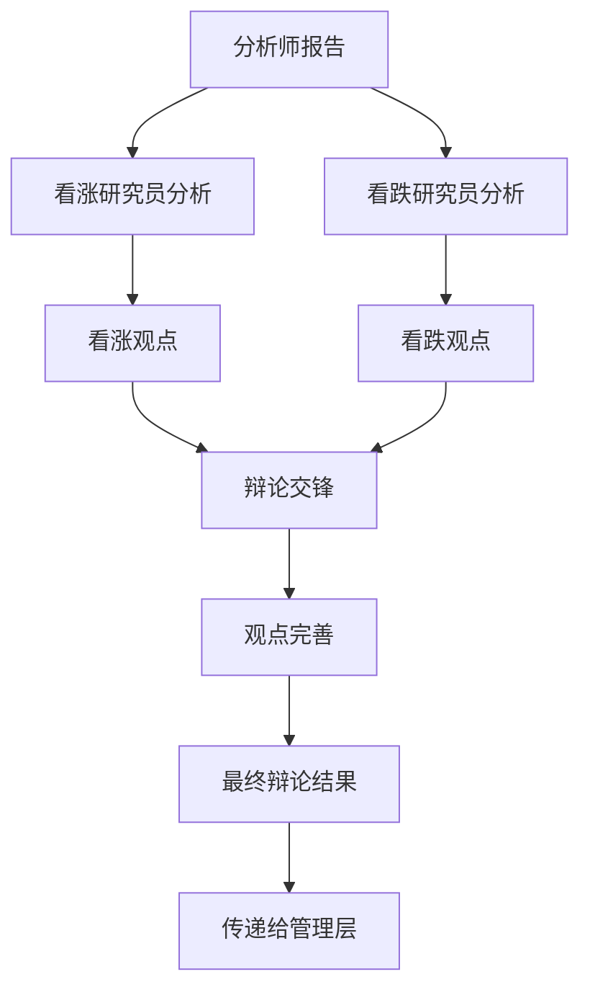

# 研究员团队

## 概述

研究员团队是 TradingAgents 框架的核心决策组件，负责基于分析师提供的数据进行深度研究和投资辩论。团队由看涨研究员和看跌研究员组成，通过对立观点的辩论来全面评估投资机会和风险，为最终的投资决策提供平衡的视角。

## 研究员架构

### 基础研究员设计

所有研究员都基于统一的架构设计，使用相同的状态管理和日志系统：

```python
# 统一的研究员模块日志装饰器
from tradingagents.utils.tool_logging import log_researcher_module

# 统一日志系统
from tradingagents.utils.logging_init import get_logger
logger = get_logger("default")

@log_researcher_module("researcher_type")
def researcher_node(state):
    # 研究员逻辑实现
    pass
```

### 智能体状态管理

研究员通过 `AgentState` 进行状态管理，包含辩论历史和分析报告：

```python
class AgentState:
    company_of_interest: str      # 股票代码
    trade_date: str              # 交易日期
    fundamentals_report: str     # 基本面报告
    market_report: str           # 市场分析报告
    news_report: str             # 新闻分析报告
    sentiment_report: str        # 情绪分析报告
    debate_state: str            # 辩论状态
    messages: List              # 消息历史
    memory: Any                 # 历史记忆
```

## 研究员团队成员

### 1. 看涨研究员 (Bull Researcher)

**文件位置**: `tradingagents/agents/researchers/bull_researcher.py`

**核心职责**:
- 寻找和强调投资机会的积极因素
- 提出看涨观点和支持论据
- 反驳看跌观点中的薄弱环节
- 推动积极的投资决策

**核心实现**:
```python
def create_bull_researcher(llm, memory=None):
    @log_researcher_module("bull")
    def bull_node(state):
        # 获取基础信息
        company_name = state["company_of_interest"]
        debate_state = state.get("debate_state", "")
        
        # 获取股票市场信息
        from tradingagents.utils.stock_utils import StockUtils
        market_info = StockUtils.get_market_info(company_name)
        
        # 安全检查
        if memory is None:
            logger.warning(f"⚠️ [DEBUG] memory为None，跳过历史记忆检索")
        
        # 构建看涨论证
        messages = state.get("messages", [])
        
        # 分析各类报告并提出看涨观点
        market_report = state.get("market_report", "")
        sentiment_report = state.get("sentiment_report", "")
        news_report = state.get("news_report", "")
        fundamentals_report = state.get("fundamentals_report", "")
```

**分析策略**:
- **积极解读数据**: 从乐观角度解释市场数据和财务指标
- **机会识别**: 发现被市场低估的价值和增长潜力
- **风险最小化**: 论证风险的可控性和临时性
- **催化剂分析**: 识别可能推动股价上涨的因素

### 2. 看跌研究员 (Bear Researcher)

**文件位置**: `tradingagents/agents/researchers/bear_researcher.py`

**核心职责**:
- 识别和强调投资风险和负面因素
- 提出看跌观点和警示论据
- 质疑看涨观点中的乐观假设
- 推动谨慎的投资决策

**核心实现**:
```python
def create_bear_researcher(llm, memory=None):
    @log_researcher_module("bear")
    def bear_node(state):
        # 获取基础信息
        company_name = state["company_of_interest"]
        debate_state = state.get("debate_state", "")
        
        # 获取股票市场信息
        from tradingagents.utils.stock_utils import StockUtils
        market_info = StockUtils.get_market_info(company_name)
        
        # 安全检查
        if memory is None:
            logger.warning(f"⚠️ [DEBUG] memory为None，跳过历史记忆检索")
        
        # 构建看跌论证
        messages = state.get("messages", [])
        
        # 分析各类报告并提出看跌观点
        market_report = state.get("market_report", "")
        sentiment_report = state.get("sentiment_report", "")
        news_report = state.get("news_report", "")
        fundamentals_report = state.get("fundamentals_report", "")
```

**分析策略**:
- **风险放大**: 深入分析潜在风险和负面因素
- **估值质疑**: 质疑当前估值的合理性
- **趋势反转**: 识别可能的负面趋势转折点
- **竞争威胁**: 分析行业竞争和市场变化风险

## 辩论机制

### 辩论流程



### 辩论状态管理

```python
# 辩论状态类型
DEBATE_STATES = {
    "initial": "初始状态",
    "bull_turn": "看涨方发言",
    "bear_turn": "看跌方发言",
    "rebuttal": "反驳阶段",
    "conclusion": "总结阶段"
}

# 状态转换逻辑
def update_debate_state(current_state, participant):
    if current_state == "initial":
        return "bull_turn" if participant == "bull" else "bear_turn"
    elif current_state in ["bull_turn", "bear_turn"]:
        return "rebuttal"
    elif current_state == "rebuttal":
        return "conclusion"
    return current_state
```

### 记忆系统集成

研究员支持历史记忆功能，能够：

1. **历史辩论回顾**: 参考之前的辩论结果和观点
2. **学习改进**: 从历史决策的成败中学习
3. **一致性维护**: 保持观点的逻辑一致性
4. **经验积累**: 积累特定股票或行业的分析经验

```python
# 记忆检索示例
if memory is not None:
    historical_debates = memory.get_relevant_debates(company_name)
    previous_analysis = memory.get_analysis_history(company_name)
else:
    logger.warning(f"⚠️ [DEBUG] memory为None，跳过历史记忆检索")
```

## 股票类型支持

### 多市场分析能力

研究员团队支持全球主要股票市场的分析：

```python
# 市场信息获取
from tradingagents.utils.stock_utils import StockUtils
market_info = StockUtils.get_market_info(ticker)

# 根据市场类型调整分析策略
if market_info.get("is_china"):
    # A股特有的分析逻辑
    analysis_context = "中国A股市场"
    currency = "人民币"
elif market_info.get("is_hk"):
    # 港股特有的分析逻辑
    analysis_context = "香港股市"
    currency = "港币"
elif market_info.get("is_us"):
    # 美股特有的分析逻辑
    analysis_context = "美国股市"
    currency = "美元"
```

### 本土化分析

1. **A股市场**:
   - 政策影响分析
   - 监管环境评估
   - 国内经济周期考量
   - 投资者结构特点

2. **港股市场**:
   - 中港两地联动
   - 汇率风险评估
   - 国际资本流动
   - 估值差异分析

3. **美股市场**:
   - 美联储政策影响
   - 全球经济环境
   - 行业竞争格局
   - 技术创新趋势

## 分析维度

### 看涨研究员关注点

1. **增长潜力**:
   - 收入增长趋势
   - 市场份额扩张
   - 新产品/服务机会
   - 国际化进展

2. **估值优势**:
   - 相对估值吸引力
   - 历史估值比较
   - 同行业估值对比
   - 资产价值重估

3. **催化因素**:
   - 政策利好
   - 行业景气度提升
   - 技术突破
   - 管理层变化

4. **财务健康**:
   - 现金流改善
   - 盈利能力提升
   - 债务结构优化
   - 分红政策

### 看跌研究员关注点

1. **风险因素**:
   - 行业衰退风险
   - 竞争加剧威胁
   - 监管政策风险
   - 技术替代风险

2. **估值风险**:
   - 估值过高警示
   - 泡沫风险评估
   - 盈利预期过于乐观
   - 市场情绪过热

3. **财务问题**:
   - 现金流恶化
   - 债务负担过重
   - 盈利质量下降
   - 会计问题质疑

4. **宏观环境**:
   - 经济周期下行
   - 利率上升影响
   - 汇率波动风险
   - 地缘政治风险

## 辩论质量评估

### 论证强度指标

1. **数据支撑度**:
   - 引用数据的准确性
   - 数据来源的可靠性
   - 数据分析的深度
   - 数据解读的合理性

2. **逻辑一致性**:
   - 论证链条的完整性
   - 推理过程的严密性
   - 结论与前提的一致性
   - 反驳的有效性

3. **风险识别**:
   - 风险因素的全面性
   - 风险评估的准确性
   - 风险应对的可行性
   - 风险权衡的合理性

### 辩论输出质量

```python
# 辩论结果结构
class DebateResult:
    bull_arguments: List[str]     # 看涨论点
    bear_arguments: List[str]     # 看跌论点
    key_disagreements: List[str]  # 主要分歧
    consensus_points: List[str]   # 共识观点
    confidence_level: float       # 置信度
    recommendation_strength: str  # 建议强度
```

## 配置选项

### 研究员配置

```python
researcher_config = {
    "enable_memory": True,        # 是否启用记忆功能
    "debate_rounds": 3,           # 辩论轮数
    "argument_depth": "deep",     # 论证深度
    "risk_tolerance": "moderate", # 风险容忍度
    "analysis_style": "balanced" # 分析风格
}
```

### 辩论参数

```python
debate_params = {
    "max_rounds": 5,              # 最大辩论轮数
    "time_limit": 300,            # 单轮时间限制(秒)
    "evidence_weight": 0.7,       # 证据权重
    "logic_weight": 0.3,          # 逻辑权重
    "consensus_threshold": 0.8    # 共识阈值
}
```

## 性能优化

### 并行处理

```python
# 并行执行看涨和看跌分析
import asyncio

async def parallel_research(state):
    bull_task = asyncio.create_task(bull_researcher(state))
    bear_task = asyncio.create_task(bear_researcher(state))
    
    bull_result, bear_result = await asyncio.gather(bull_task, bear_task)
    return bull_result, bear_result
```

### 缓存机制

```python
# 分析结果缓存
from functools import lru_cache

@lru_cache(maxsize=100)
def cached_analysis(ticker, date, report_hash):
    # 缓存分析结果
    pass
```

## 日志和监控

### 详细日志记录

```python
# 研究员活动日志
logger.info(f"🐂 [看涨研究员] 开始分析股票: {company_name}")
logger.info(f"🐻 [看跌研究员] 开始分析股票: {company_name}")
logger.debug(f"📊 [辩论状态] 当前状态: {debate_state}")
logger.warning(f"⚠️ [记忆系统] memory为None，跳过历史记忆检索")
```

### 性能指标

- 辩论完成时间
- 论证质量评分
- 预测准确率
- 风险识别率
- 共识达成率

## 扩展指南

### 添加新的研究员类型

1. **创建研究员文件**
```python
# tradingagents/agents/researchers/neutral_researcher.py
from tradingagents.utils.tool_logging import log_researcher_module

def create_neutral_researcher(llm, memory=None):
    @log_researcher_module("neutral")
    def neutral_node(state):
        # 中性研究员逻辑
        pass
    return neutral_node
```

2. **集成到辩论流程**
```python
# 在trading_graph.py中添加
researchers = {
    "bull": create_bull_researcher(llm, memory),
    "bear": create_bear_researcher(llm, memory),
    "neutral": create_neutral_researcher(llm, memory)
}
```

### 自定义辩论策略

1. **实现策略接口**
```python
class DebateStrategy:
    def generate_arguments(self, reports, market_info):
        pass
    
    def evaluate_counterarguments(self, opponent_args):
        pass
    
    def synthesize_conclusion(self, all_arguments):
        pass
```

2. **注册策略**
```python
strategy_registry = {
    "aggressive_bull": AggressiveBullStrategy(),
    "conservative_bear": ConservativeBearStrategy(),
    "data_driven": DataDrivenStrategy()
}
```

## 最佳实践

### 1. 平衡性维护
- 确保看涨和看跌观点的平衡
- 避免极端偏见
- 基于数据而非情绪
- 保持客观分析态度

### 2. 质量控制
- 验证数据来源
- 检查逻辑一致性
- 评估论证强度
- 识别认知偏差

### 3. 效率优化
- 并行执行分析
- 缓存重复计算
- 优化内存使用
- 减少冗余操作

### 4. 可解释性
- 提供清晰的推理路径
- 标注关键假设
- 量化不确定性
- 记录决策依据

## 故障排除

### 常见问题

1. **辩论陷入僵局**
   - 引入新的分析维度
   - 调整权重参数
   - 增加外部信息
   - 设置超时机制

2. **观点过于极端**
   - 调整风险容忍度
   - 增加平衡机制
   - 引入中性观点
   - 强化数据验证

3. **性能问题**
   - 启用并行处理
   - 优化缓存策略
   - 减少分析深度
   - 限制辩论轮数

### 调试技巧

1. **辩论过程追踪**
```python
logger.debug(f"辩论轮次: {round_number}")
logger.debug(f"当前发言方: {current_speaker}")
logger.debug(f"论点数量: {len(arguments)}")
```

2. **状态检查**
```python
logger.debug(f"状态完整性: {validate_state(state)}")
logger.debug(f"报告可用性: {check_reports_availability(state)}")
```

3. **性能监控**
```python
import time
start_time = time.time()
# 执行分析
end_time = time.time()
logger.debug(f"分析耗时: {end_time - start_time:.2f}秒")
```

研究员团队通过结构化的辩论机制，确保投资决策的全面性和客观性，是TradingAgents框架中连接数据分析和最终决策的关键环节。