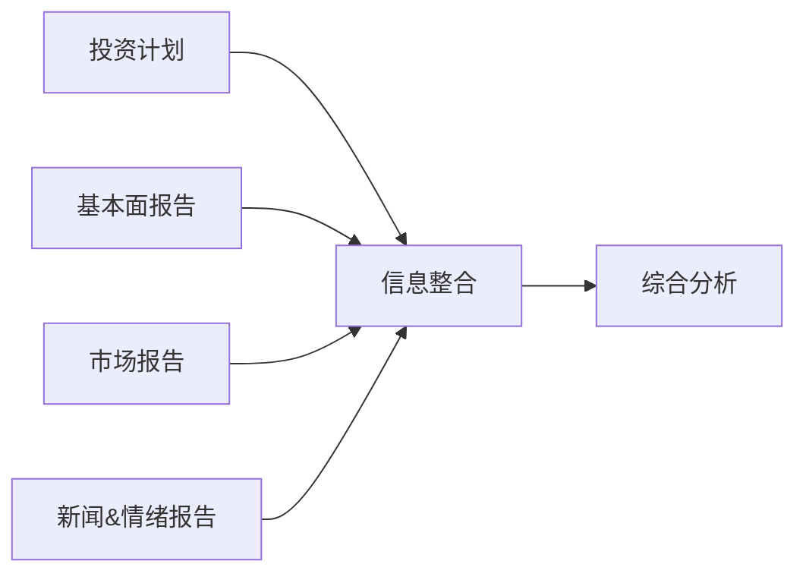
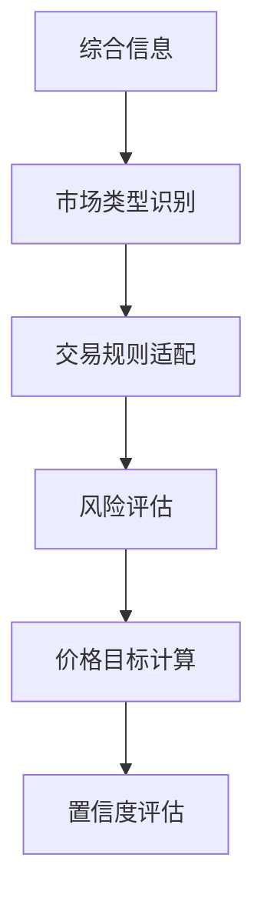
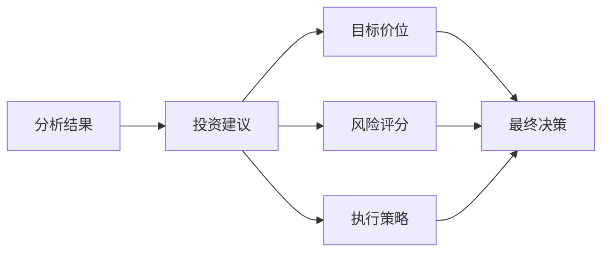

# 交易员

## 概述

交易员是 TradingAgents 框架的执行层核心，负责基于研究员团队的辩论结果和管理层的投资计划，生成具体的投资建议和交易决策。交易员将所有前期分析和决策转化为可执行的投资行动，包括具体的目标价位、置信度评估和风险评分。

## 交易员架构

### 基础设计

交易员基于统一的架构设计，集成了多维度分析能力和决策执行功能：

```python
# 统一的交易员模块日志装饰器
from tradingagents.utils.tool_logging import log_trader_module

# 统一日志系统
from tradingagents.utils.logging_init import get_logger
logger = get_logger("default")

@log_trader_module("trader")
def trader_node(state):
    # 交易员逻辑实现
    pass
```

### 智能体状态管理

交易员通过 `AgentState` 获取完整的分析链条信息：

```python
class AgentState:
    company_of_interest: str      # 股票代码
    trade_date: str              # 交易日期
    fundamentals_report: str     # 基本面报告
    market_report: str           # 市场分析报告
    news_report: str             # 新闻分析报告
    sentiment_report: str        # 情绪分析报告
    investment_plan: str         # 投资计划
    messages: List              # 消息历史
```

## 交易员实现

### 核心功能

**文件位置**: `tradingagents/agents/trader/trader.py`

**核心职责**:
- 综合分析所有输入信息
- 生成具体的投资建议
- 提供目标价位和置信度
- 评估投资风险等级
- 制定执行策略

### 核心实现逻辑

```python
def create_trader(llm):
    @log_trader_module("trader")
    def trader_node(state):
        # 获取基础信息
        company_name = state["company_of_interest"]
        investment_plan = state.get("investment_plan", "")
        
        # 获取股票市场信息
        from tradingagents.utils.stock_utils import StockUtils
        market_info = StockUtils.get_market_info(company_name)
        
        # 确定股票类型和货币信息
        if market_info.get("is_china"):
            stock_type = "A股"
            currency_unit = "人民币"
        elif market_info.get("is_hk"):
            stock_type = "港股"
            currency_unit = "港币"
        elif market_info.get("is_us"):
            stock_type = "美股"
            currency_unit = "美元"
        else:
            stock_type = "未知市场"
            currency_unit = "未知货币"
        
        # 获取各类分析报告
        market_report = state.get("market_report", "")
        sentiment_report = state.get("sentiment_report", "")
        news_report = state.get("news_report", "")
        fundamentals_report = state.get("fundamentals_report", "")
        
        # 构建交易决策提示
        trader_prompt = f"""
        作为专业交易员，请基于以下信息生成投资建议：
        
        公司名称: {company_name}
        股票类型: {stock_type}
        货币单位: {currency_unit}
        
        投资计划: {investment_plan}
        
        市场研究报告: {market_report}
        情绪报告: {sentiment_report}
        新闻报告: {news_report}
        基本面报告: {fundamentals_report}
        
        请提供：
        1. 明确的投资建议（买入/卖出/持有）
        2. 具体目标价位（以{currency_unit}计价）
        3. 置信度评估（0-100%）
        4. 风险评分（1-10分）
        5. 详细推理过程
        """
        
        # 调用LLM生成交易决策
        response = llm.invoke(trader_prompt)
        
        return {"trader_recommendation": response.content}
```

## 决策输入分析

### 多维度信息整合

交易员需要综合处理来自多个源头的信息：

1. **投资计划** (`investment_plan`)
   - 来源：研究管理员的综合决策
   - 内容：基于辩论结果的投资建议
   - 作用：提供决策框架和方向指导

2. **市场研究报告** (`market_report`)
   - 来源：市场分析师
   - 内容：技术指标、价格趋势、交易信号
   - 作用：提供技术面分析支持

3. **情绪报告** (`sentiment_report`)
   - 来源：社交媒体分析师
   - 内容：投资者情绪、舆论趋势
   - 作用：评估市场情绪影响

4. **新闻报告** (`news_report`)
   - 来源：新闻分析师
   - 内容：重要新闻事件、政策影响
   - 作用：识别催化因素和风险事件

5. **基本面报告** (`fundamentals_report`)
   - 来源：基本面分析师
   - 内容：财务数据、估值分析
   - 作用：提供价值投资依据

### 信息权重分配

```python
# 信息权重配置示例
info_weights = {
    "investment_plan": 0.35,      # 投资计划权重最高
    "fundamentals_report": 0.25,  # 基本面分析
    "market_report": 0.20,        # 技术分析
    "news_report": 0.15,          # 新闻影响
    "sentiment_report": 0.05       # 情绪分析
}
```

## 股票类型支持

### 多市场交易能力

交易员支持全球主要股票市场的交易决策：

```python
# 市场信息获取和处理
from tradingagents.utils.stock_utils import StockUtils
market_info = StockUtils.get_market_info(company_name)

# 根据市场类型调整交易策略
if market_info.get("is_china"):
    # A股交易特点
    trading_hours = "09:30-15:00 (北京时间)"
    price_limit = "±10% (ST股票±5%)"
    settlement = "T+1"
    currency = "人民币(CNY)"
    
elif market_info.get("is_hk"):
    # 港股交易特点
    trading_hours = "09:30-16:00 (香港时间)"
    price_limit = "无涨跌停限制"
    settlement = "T+2"
    currency = "港币(HKD)"
    
elif market_info.get("is_us"):
    # 美股交易特点
    trading_hours = "09:30-16:00 (EST)"
    price_limit = "无涨跌停限制"
    settlement = "T+2"
    currency = "美元(USD)"
```

### 本土化交易策略

1. **A股市场特色**:
   - 涨跌停板制度考虑
   - T+1交易制度影响
   - 政策敏感性分析
   - 散户投资者行为特点

2. **港股市场特色**:
   - 中港资金流动
   - 汇率风险管理
   - 国际投资者参与
   - 估值差异套利

3. **美股市场特色**:
   - 盘前盘后交易
   - 期权策略考虑
   - 机构投资者主导
   - 全球经济影响

## 决策输出规范

### 标准输出格式

交易员必须提供结构化的投资建议：

```python
class TradingRecommendation:
    action: str              # 投资行动 (买入/卖出/持有)
    target_price: float      # 目标价位
    confidence: float        # 置信度 (0-100%)
    risk_score: int          # 风险评分 (1-10)
    reasoning: str           # 详细推理
    time_horizon: str        # 投资时间框架
    stop_loss: float         # 止损价位
    take_profit: float       # 止盈价位
```

### 强制要求

根据代码实现，交易员必须提供：

1. **具体目标价位**
   - 必须以相应货币单位计价
   - 基于综合分析的合理估值
   - 考虑市场流动性和交易成本

2. **置信度评估**
   - 0-100%的数值范围
   - 反映决策的确定性程度
   - 基于信息质量和分析深度

3. **风险评分**
   - 1-10分的评分体系
   - 1分为最低风险，10分为最高风险
   - 综合考虑各类风险因素

4. **详细推理**
   - 完整的决策逻辑链条
   - 关键假设和依据说明
   - 风险因素识别和应对

## 决策流程

### 1. 信息收集阶段



### 2. 分析处理阶段



### 3. 决策生成阶段



## 风险管理

### 风险评估维度

1. **市场风险**:
   - 系统性风险评估
   - 行业周期风险
   - 流动性风险
   - 波动率风险

2. **信用风险**:
   - 公司财务风险
   - 债务违约风险
   - 管理层风险
   - 治理结构风险

3. **操作风险**:
   - 交易执行风险
   - 技术系统风险
   - 人为操作风险
   - 合规风险

4. **特殊风险**:
   - 政策监管风险
   - 汇率风险
   - 地缘政治风险
   - 黑天鹅事件

### 风险控制措施

```python
# 风险控制参数
risk_controls = {
    "max_position_size": 0.05,    # 最大仓位比例
    "stop_loss_ratio": 0.08,      # 止损比例
    "take_profit_ratio": 0.15,    # 止盈比例
    "max_drawdown": 0.10,         # 最大回撤
    "correlation_limit": 0.70     # 相关性限制
}
```

## 性能评估

### 关键指标

1. **准确性指标**:
   - 预测准确率
   - 目标价位达成率
   - 方向判断正确率
   - 时间框架准确性

2. **收益指标**:
   - 绝对收益率
   - 相对基准收益
   - 风险调整收益
   - 夏普比率

3. **风险指标**:
   - 最大回撤
   - 波动率
   - VaR值
   - 风险评分准确性

### 性能监控

```python
# 交易性能追踪
class TradingPerformance:
    def __init__(self):
        self.trades = []
        self.accuracy_rate = 0.0
        self.total_return = 0.0
        self.max_drawdown = 0.0
        self.sharpe_ratio = 0.0
    
    def update_performance(self, trade_result):
        # 更新性能指标
        pass
    
    def generate_report(self):
        # 生成性能报告
        pass
```

## 配置选项

### 交易员配置

```python
trader_config = {
    "risk_tolerance": "moderate",     # 风险容忍度
    "investment_style": "balanced",   # 投资风格
    "time_horizon": "medium",         # 投资时间框架
    "position_sizing": "kelly",       # 仓位管理方法
    "rebalance_frequency": "weekly"   # 再平衡频率
}
```

### 市场配置

```python
market_config = {
    "trading_hours": {
        "china": "09:30-15:00",
        "hk": "09:30-16:00",
        "us": "09:30-16:00"
    },
    "settlement_days": {
        "china": 1,
        "hk": 2,
        "us": 2
    },
    "commission_rates": {
        "china": 0.0003,
        "hk": 0.0025,
        "us": 0.0005
    }
}
```

## 日志和监控

### 详细日志记录

```python
# 交易员活动日志
logger.info(f"💼 [交易员] 开始分析股票: {company_name}")
logger.info(f"📈 [交易员] 股票类型: {stock_type}, 货币: {currency_unit}")
logger.debug(f"📊 [交易员] 投资计划: {investment_plan[:100]}...")
logger.info(f"🎯 [交易员] 生成投资建议完成")
```

### 决策追踪

```python
# 决策过程记录
decision_log = {
    "timestamp": datetime.now(),
    "ticker": company_name,
    "market_type": stock_type,
    "input_reports": {
        "fundamentals": len(fundamentals_report),
        "market": len(market_report),
        "news": len(news_report),
        "sentiment": len(sentiment_report)
    },
    "decision": {
        "action": action,
        "target_price": target_price,
        "confidence": confidence,
        "risk_score": risk_score
    }
}
```

## 扩展指南

### 添加新的交易策略

1. **创建策略类**
```python
class CustomTradingStrategy:
    def __init__(self, config):
        self.config = config
    
    def generate_recommendation(self, state):
        # 自定义交易逻辑
        pass
    
    def calculate_position_size(self, confidence, risk_score):
        # 仓位计算逻辑
        pass
```

2. **集成到交易员**
```python
# 在trader.py中添加策略选择
strategy_map = {
    "conservative": ConservativeStrategy(),
    "aggressive": AggressiveStrategy(),
    "custom": CustomTradingStrategy()
}

strategy = strategy_map.get(config.get("strategy", "balanced"))
```

### 添加新的风险模型

1. **实现风险模型接口**
```python
class RiskModel:
    def calculate_risk_score(self, market_data, fundamentals):
        pass
    
    def estimate_var(self, position, confidence_level):
        pass
    
    def suggest_position_size(self, risk_budget, expected_return):
        pass
```

2. **注册风险模型**
```python
risk_models = {
    "var": VaRRiskModel(),
    "monte_carlo": MonteCarloRiskModel(),
    "factor": FactorRiskModel()
}
```

## 最佳实践

### 1. 决策一致性
- 保持决策逻辑的一致性
- 避免情绪化决策
- 基于数据和分析
- 记录决策依据

### 2. 风险控制
- 严格执行止损策略
- 分散投资风险
- 定期评估风险敞口
- 及时调整仓位

### 3. 性能优化
- 持续监控交易表现
- 定期回测策略效果
- 优化决策模型
- 学习市场变化

### 4. 合规管理
- 遵守交易规则
- 满足监管要求
- 保持透明度
- 记录完整审计轨迹

## 故障排除

### 常见问题

1. **决策质量问题**
   - 检查输入数据质量
   - 验证分析逻辑
   - 调整权重配置
   - 增加验证步骤

2. **风险控制失效**
   - 检查风险参数设置
   - 验证止损机制
   - 评估相关性计算
   - 更新风险模型

3. **性能问题**
   - 优化决策算法
   - 减少计算复杂度
   - 启用结果缓存
   - 并行处理分析

### 调试技巧

1. **决策过程追踪**
```python
logger.debug(f"输入信息完整性: {check_input_completeness(state)}")
logger.debug(f"市场信息: {market_info}")
logger.debug(f"决策权重: {info_weights}")
```

2. **结果验证**
```python
logger.debug(f"目标价位合理性: {validate_target_price(target_price)}")
logger.debug(f"风险评分一致性: {validate_risk_score(risk_score)}")
```

3. **性能监控**
```python
import time
start_time = time.time()
# 执行交易决策
end_time = time.time()
logger.debug(f"决策耗时: {end_time - start_time:.2f}秒")
```

交易员作为TradingAgents框架的最终执行层，承担着将所有分析和研究转化为具体投资行动的重要职责，其决策质量直接影响整个系统的投资表现。