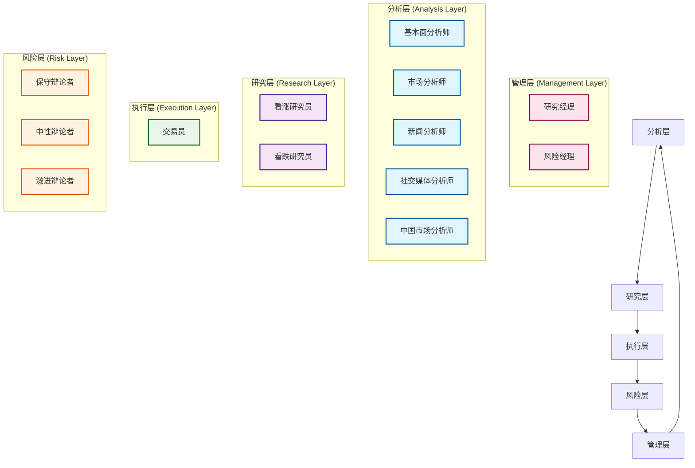

# TradingAgents 智能体架构

## 概述

TradingAgents 采用多智能体协作架构，模拟真实金融机构的团队协作模式。每个智能体都有明确的职责分工，通过状态共享和消息传递实现协作决策。本文档基于实际代码结构，详细描述了智能体的架构设计和实现细节。

## 🏗️ 智能体层次结构

### 架构层次

TradingAgents 采用5层智能体架构，每层专注于特定的功能领域：



### 层次职责

- **分析层**: 负责数据收集和初步分析
- **研究层**: 进行深度研究和观点辩论
- **执行层**: 制定具体的交易决策
- **风险层**: 评估和管理投资风险
- **管理层**: 协调决策和最终审批

## 🔧 智能体状态管理

### AgentState 核心状态类

基于实际代码 `tradingagents/agents/utils/agent_states.py`，系统使用 `AgentState` 类管理所有智能体的共享状态：

```python
from typing import Annotated
from langgraph.graph import MessagesState

class AgentState(MessagesState):
    """智能体状态管理类 - 继承自 LangGraph MessagesState"""
    
    # 基础信息
    company_of_interest: Annotated[str, "目标分析公司股票代码"]
    trade_date: Annotated[str, "交易日期"]
    sender: Annotated[str, "发送消息的智能体"]
    
    # 分析师报告
    market_report: Annotated[str, "市场分析师报告"]
    sentiment_report: Annotated[str, "社交媒体分析师报告"]
    news_report: Annotated[str, "新闻分析师报告"]
    fundamentals_report: Annotated[str, "基本面分析师报告"]
    
    # 研究和决策
    investment_debate_state: Annotated[InvestDebateState, "投资辩论状态"]
    investment_plan: Annotated[str, "投资计划"]
    trader_investment_plan: Annotated[str, "交易员投资计划"]
    
    # 风险管理
    risk_debate_state: Annotated[RiskDebateState, "风险辩论状态"]
    final_trade_decision: Annotated[str, "最终交易决策"]
```

### 辩论状态管理

#### 投资辩论状态

```python
class InvestDebateState(TypedDict):
    """研究员团队辩论状态"""
    bull_history: Annotated[str, "看涨方对话历史"]
    bear_history: Annotated[str, "看跌方对话历史"]
    history: Annotated[str, "完整对话历史"]
    current_response: Annotated[str, "最新回应"]
    judge_decision: Annotated[str, "最终判决"]
    count: Annotated[int, "对话轮次计数"]
```

#### 风险辩论状态

```python
class RiskDebateState(TypedDict):
    """风险管理团队辩论状态"""
    risky_history: Annotated[str, "激进分析师对话历史"]
    safe_history: Annotated[str, "保守分析师对话历史"]
    neutral_history: Annotated[str, "中性分析师对话历史"]
    history: Annotated[str, "完整对话历史"]
    latest_speaker: Annotated[str, "最后发言的分析师"]
    current_risky_response: Annotated[str, "激进分析师最新回应"]
    current_safe_response: Annotated[str, "保守分析师最新回应"]
    current_neutral_response: Annotated[str, "中性分析师最新回应"]
    judge_decision: Annotated[str, "判决结果"]
    count: Annotated[int, "对话轮次计数"]
```

## 🤖 智能体实现架构

### 分析师团队 (Analysis Layer)

#### 1. 基本面分析师

**文件位置**: `tradingagents/agents/analysts/fundamentals_analyst.py`

```python
from tradingagents.utils.tool_logging import log_analyst_module
from tradingagents.utils.logging_init import get_logger

def create_fundamentals_analyst(llm, toolkit):
    @log_analyst_module("fundamentals")
    def fundamentals_analyst_node(state):
        """基本面分析师节点实现"""
        logger = get_logger("default")
        
        # 获取输入参数
        current_date = state["trade_date"]
        ticker = state["company_of_interest"]
        
        # 股票类型检测
        from tradingagents.utils.stock_utils import StockUtils
        market_info = StockUtils.get_market_info(ticker)
        
        # 选择合适的分析工具
        if toolkit.config["online_tools"]:
            tools = [toolkit.get_stock_fundamentals_unified]
        else:
            # 离线模式工具选择
            tools = [toolkit.get_fundamentals_openai]
        
        # 执行分析逻辑
        # ...
        
        return state
    
    return fundamentals_analyst_node
```

#### 2. 市场分析师

**文件位置**: `tradingagents/agents/analysts/market_analyst.py`

```python
def create_market_analyst(llm, toolkit):
    @log_analyst_module("market")
    def market_analyst_node(state):
        """市场分析师节点实现"""
        # 技术分析和市场趋势分析
        # ...
        return state
    
    return market_analyst_node
```

#### 3. 新闻分析师

**文件位置**: `tradingagents/agents/analysts/news_analyst.py`

```python
def create_news_analyst(llm, toolkit):
    @log_analyst_module("news")
    def news_analyst_node(state):
        """新闻分析师节点实现"""
        # 新闻情绪分析和事件影响评估
        # ...
        return state
    
    return news_analyst_node
```

#### 4. 社交媒体分析师

**文件位置**: `tradingagents/agents/analysts/social_media_analyst.py`

```python
def create_social_media_analyst(llm, toolkit):
    @log_analyst_module("social_media")
    def social_media_analyst_node(state):
        """社交媒体分析师节点实现"""
        # 社交媒体情绪分析
        # ...
        return state
    
    return social_media_analyst_node
```

#### 5. 中国市场分析师

**文件位置**: `tradingagents/agents/analysts/china_market_analyst.py`

```python
def create_china_market_analyst(llm, toolkit):
    @log_analyst_module("china_market")
    def china_market_analyst_node(state):
        """中国市场分析师节点实现"""
        # 专门针对中国A股市场的分析
        # ...
        return state
    
    return china_market_analyst_node
```

### 研究员团队 (Research Layer)

#### 1. 看涨研究员

**文件位置**: `tradingagents/agents/researchers/bull_researcher.py`

```python
def create_bull_researcher(llm):
    def bull_researcher_node(state):
        """看涨研究员节点实现"""
        # 基于分析师报告生成看涨观点
        # ...
        return state
    
    return bull_researcher_node
```

#### 2. 看跌研究员

**文件位置**: `tradingagents/agents/researchers/bear_researcher.py`

```python
def create_bear_researcher(llm):
    def bear_researcher_node(state):
        """看跌研究员节点实现"""
        # 基于分析师报告生成看跌观点
        # ...
        return state
    
    return bear_researcher_node
```

### 交易员 (Execution Layer)

**文件位置**: `tradingagents/agents/trader/trader.py`

```python
def create_trader(llm, memory):
    def trader_node(state, name):
        """交易员节点实现"""
        # 获取所有分析报告
        company_name = state["company_of_interest"]
        investment_plan = state["investment_plan"]
        market_research_report = state["market_report"]
        sentiment_report = state["sentiment_report"]
        news_report = state["news_report"]
        fundamentals_report = state["fundamentals_report"]
        
        # 股票类型检测
        from tradingagents.utils.stock_utils import StockUtils
        market_info = StockUtils.get_market_info(company_name)
        
        # 货币单位确定
        currency = market_info['currency_name']
        currency_symbol = market_info['currency_symbol']
        
        # 历史记忆检索
        if memory is not None:
            past_memories = memory.get_memories(curr_situation, n_matches=2)
        
        # 生成交易决策
        # ...
        
        return state
    
    return trader_node
```

### 风险管理团队 (Risk Layer)

#### 1. 保守辩论者

**文件位置**: `tradingagents/agents/risk_mgmt/conservative_debator.py`

```python
def create_conservative_debator(llm):
    def conservative_debator_node(state):
        """保守风险辩论者节点实现"""
        # 保守的风险评估观点
        # ...
        return state
    
    return conservative_debator_node
```

#### 2. 中性辩论者

**文件位置**: `tradingagents/agents/risk_mgmt/neutral_debator.py`

```python
def create_neutral_debator(llm):
    def neutral_debator_node(state):
        """中性风险辩论者节点实现"""
        # 中性的风险评估观点
        # ...
        return state
    
    return neutral_debator_node
```

#### 3. 激进辩论者

**文件位置**: `tradingagents/agents/risk_mgmt/aggresive_debator.py`

```python
def create_aggressive_debator(llm):
    def aggressive_debator_node(state):
        """激进风险辩论者节点实现"""
        # 激进的风险评估观点
        # ...
        return state
    
    return aggressive_debator_node
```

### 管理层团队 (Management Layer)

#### 1. 研究经理

**文件位置**: `tradingagents/agents/managers/research_manager.py`

```python
def create_research_manager(llm):
    def research_manager_node(state):
        """研究经理节点实现"""
        # 协调研究员辩论，形成投资计划
        # ...
        return state
    
    return research_manager_node
```

#### 2. 风险经理

**文件位置**: `tradingagents/agents/managers/risk_manager.py`

```python
def create_risk_manager(llm):
    def risk_manager_node(state):
        """风险经理节点实现"""
        # 协调风险辩论，做出最终决策
        # ...
        return state
    
    return risk_manager_node
```

## 🔧 智能体工具集成

### 统一工具架构

所有智能体都通过统一的工具接口访问数据和功能：

```python
class ToolKit:
    """统一工具包"""
    
    def __init__(self, config):
        self.config = config
    
    # 基本面分析工具
    def get_stock_fundamentals_unified(self, ticker: str):
        """统一基本面分析工具，自动识别股票类型"""
        pass
    
    # 市场数据工具
    def get_market_data(self, ticker: str):
        """获取市场数据"""
        pass
    
    # 新闻数据工具
    def get_news_data(self, ticker: str):
        """获取新闻数据"""
        pass
```

### 日志装饰器系统

系统使用统一的日志装饰器来跟踪智能体执行：

```python
from tradingagents.utils.tool_logging import log_analyst_module

@log_analyst_module("analyst_type")
def analyst_node(state):
    """分析师节点，自动记录执行日志"""
    # 智能体逻辑
    pass
```

## 🔄 智能体协作机制

### 状态传递流程

1. **初始化**: 创建 `AgentState` 实例
2. **分析阶段**: 各分析师并行执行，更新对应报告字段
3. **研究阶段**: 研究员基于分析报告进行辩论
4. **交易阶段**: 交易员综合所有信息制定交易计划
5. **风险阶段**: 风险团队评估交易风险
6. **管理阶段**: 管理层做出最终决策

### 消息传递机制

智能体通过 `MessagesState` 继承的消息系统进行通信：

```python
# 添加消息
state["messages"].append({
    "role": "assistant",
    "content": "分析结果",
    "sender": "fundamentals_analyst"
})

# 获取历史消息
history = state["messages"]
```

## 🛠️ 工具和实用程序

### 股票工具

**文件位置**: `tradingagents/agents/utils/agent_utils.py`

```python
from tradingagents.utils.stock_utils import StockUtils

# 股票类型检测
market_info = StockUtils.get_market_info(ticker)
print(f"市场类型: {market_info['market_name']}")
print(f"货币: {market_info['currency_name']}")
```

### 内存管理

**文件位置**: `tradingagents/agents/utils/memory.py`

```python
class Memory:
    """智能体记忆管理"""
    
    def get_memories(self, query: str, n_matches: int = 2):
        """检索相关历史记忆"""
        pass
    
    def add_memory(self, content: str, metadata: dict):
        """添加新记忆"""
        pass
```

### Google工具处理器

**文件位置**: `tradingagents/agents/utils/google_tool_handler.py`

```python
class GoogleToolCallHandler:
    """Google AI 工具调用处理器"""
    
    def handle_tool_calls(self, response, tools, state):
        """处理Google AI的工具调用"""
        pass
```

## 📊 性能监控

### 日志系统

系统使用统一的日志系统跟踪智能体执行：

```python
from tradingagents.utils.logging_init import get_logger

logger = get_logger("default")
logger.info(f"📊 [基本面分析师] 正在分析股票: {ticker}")
logger.debug(f"📊 [DEBUG] 股票类型: {market_info}")
```

### 执行追踪

每个智能体的执行都会被详细记录：

- 输入参数
- 执行时间
- 输出结果
- 错误信息

## 🚀 扩展指南

### 添加新智能体

1. **创建智能体文件**
```python
# tradingagents/agents/analysts/custom_analyst.py
def create_custom_analyst(llm, toolkit):
    @log_analyst_module("custom")
    def custom_analyst_node(state):
        # 自定义分析逻辑
        return state
    
    return custom_analyst_node
```

2. **更新状态类**
```python
# 在 AgentState 中添加新字段
custom_report: Annotated[str, "自定义分析师报告"]
```

3. **集成到工作流**
```python
# 在图构建器中添加节点
workflow.add_node("custom_analyst", create_custom_analyst(llm, toolkit))
```

### 扩展工具集

```python
class ExtendedToolKit(ToolKit):
    def get_custom_data(self, ticker: str):
        """自定义数据获取工具"""
        pass
```

## 🔧 配置选项

### 智能体配置

```python
agent_config = {
    "online_tools": True,  # 是否使用在线工具
    "memory_enabled": True,  # 是否启用记忆功能
    "debug_mode": False,  # 调试模式
    "max_iterations": 10,  # 最大迭代次数
}
```

### 日志配置

```python
logging_config = {
    "level": "INFO",
    "format": "%(asctime)s - %(name)s - %(levelname)s - %(message)s",
    "handlers": ["console", "file"]
}
```

## 🛡️ 最佳实践

### 1. 状态管理
- 始终通过 `AgentState` 传递数据
- 避免在智能体间直接共享变量
- 使用类型注解确保数据一致性

### 2. 错误处理
- 在每个智能体中添加异常处理
- 使用日志记录错误信息
- 提供降级策略

### 3. 性能优化
- 使用缓存减少重复计算
- 并行执行独立的智能体
- 监控内存使用情况

### 4. 代码组织
- 每个智能体独立文件
- 统一的命名规范
- 清晰的文档注释

TradingAgents 智能体架构通过清晰的分层设计、统一的状态管理和灵活的扩展机制，为复杂的金融决策流程提供了强大而可靠的技术基础。