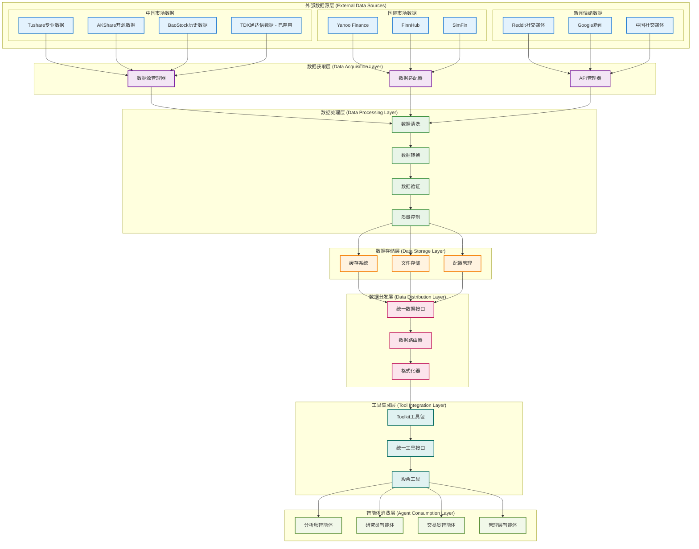
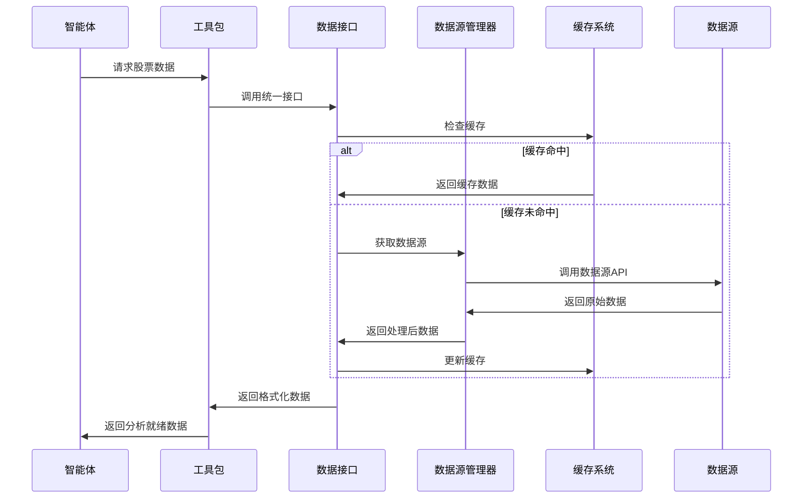

# TradingAgents 数据流架构

## 概述

TradingAgents 采用多层次数据流架构，支持中国A股、港股和美股的全面数据获取和处理。系统通过统一的数据接口、智能的数据源管理和高效的缓存机制，为智能体提供高质量的金融数据服务。

## 🏗️ 数据流架构设计

### 架构层次图



## 📊 各层次详细说明

### 1. 外部数据源层 (External Data Sources)

#### 中国市场数据源

##### Tushare 专业数据源 (推荐)
**文件位置**: `tradingagents/dataflows/tushare_utils.py`

```python
import tushare as ts
from tradingagents.utils.logging_manager import get_logger

class TushareProvider:
    """Tushare数据提供商"""
    
    def __init__(self):
        self.token = os.getenv('TUSHARE_TOKEN')
        if self.token:
            ts.set_token(self.token)
            self.pro = ts.pro_api()
        else:
            raise ValueError("TUSHARE_TOKEN环境变量未设置")
    
    def get_stock_data(self, ts_code: str, start_date: str, end_date: str):
        """获取股票历史数据"""
        try:
            df = self.pro.daily(
                ts_code=ts_code,
                start_date=start_date.replace('-', ''),
                end_date=end_date.replace('-', '')
            )
            return df
        except Exception as e:
            logger.error(f"Tushare数据获取失败: {e}")
            return None
    
    def get_stock_basic(self, ts_code: str):
        """获取股票基本信息"""
        try:
            df = self.pro.stock_basic(
                ts_code=ts_code,
                fields='ts_code,symbol,name,area,industry,market,list_date'
            )
            return df
        except Exception as e:
            logger.error(f"Tushare基本信息获取失败: {e}")
            return None
```

##### AKShare 开源数据源 (备用)
**文件位置**: `tradingagents/dataflows/akshare_utils.py`

```python
import akshare as ak
import pandas as pd
from typing import Optional, Dict, Any

def get_akshare_provider():
    """获取AKShare数据提供商实例"""
    return AKShareProvider()

class AKShareProvider:
    """AKShare数据提供商"""
    
    def __init__(self):
        self.logger = get_logger('agents')
    
    def get_stock_zh_a_hist(self, symbol: str, period: str = "daily", 
                           start_date: str = None, end_date: str = None):
        """获取A股历史数据"""
        try:
            df = ak.stock_zh_a_hist(
                symbol=symbol,
                period=period,
                start_date=start_date,
                end_date=end_date,
                adjust="qfq"  # 前复权
            )
            return df
        except Exception as e:
            self.logger.error(f"AKShare A股数据获取失败: {e}")
            return None
    
    def get_hk_stock_data_akshare(self, symbol: str, period: str = "daily"):
        """获取港股数据"""
        try:
            # 港股代码格式转换
            if not symbol.startswith('0') and len(symbol) <= 5:
                symbol = symbol.zfill(5)
            
            df = ak.stock_hk_hist(
                symbol=symbol,
                period=period,
                adjust="qfq"
            )
            return df
        except Exception as e:
            self.logger.error(f"AKShare港股数据获取失败: {e}")
            return None
    
    def get_hk_stock_info_akshare(self, symbol: str):
        """获取港股基本信息"""
        try:
            df = ak.stock_hk_spot_em()
            if not df.empty:
                # 查找匹配的股票
                matched = df[df['代码'].str.contains(symbol, na=False)]
                return matched
            return None
        except Exception as e:
            self.logger.error(f"AKShare港股信息获取失败: {e}")
            return None
```

##### BaoStock 历史数据源 (备用)
**文件位置**: `tradingagents/dataflows/baostock_utils.py`

```python
import baostock as bs
import pandas as pd

class BaoStockProvider:
    """BaoStock数据提供商"""
    
    def __init__(self):
        self.logger = get_logger('agents')
        self.login_result = bs.login()
        if self.login_result.error_code != '0':
            self.logger.error(f"BaoStock登录失败: {self.login_result.error_msg}")
    
    def get_stock_data(self, code: str, start_date: str, end_date: str):
        """获取股票历史数据"""
        try:
            rs = bs.query_history_k_data_plus(
                code,
                "date,code,open,high,low,close,preclose,volume,amount,adjustflag,turn,tradestatus,pctChg,isST",
                start_date=start_date,
                end_date=end_date,
                frequency="d",
                adjustflag="3"  # 前复权
            )
            
            data_list = []
            while (rs.error_code == '0') & rs.next():
                data_list.append(rs.get_row_data())
            
            df = pd.DataFrame(data_list, columns=rs.fields)
            return df
        except Exception as e:
            self.logger.error(f"BaoStock数据获取失败: {e}")
            return None
    
    def __del__(self):
        """析构函数，登出BaoStock"""
        bs.logout()
```

#### 国际市场数据源

##### Yahoo Finance
**文件位置**: `tradingagents/dataflows/yfin_utils.py`

```python
import yfinance as yf
import pandas as pd
from typing import Optional

def get_yahoo_finance_data(ticker: str, period: str = "1y", 
                          start_date: str = None, end_date: str = None):
    """获取Yahoo Finance数据
    
    Args:
        ticker: 股票代码
        period: 时间周期 (1d, 5d, 1mo, 3mo, 6mo, 1y, 2y, 5y, 10y, ytd, max)
        start_date: 开始日期 (YYYY-MM-DD)
        end_date: 结束日期 (YYYY-MM-DD)
    
    Returns:
        DataFrame: 股票数据
    """
    try:
        stock = yf.Ticker(ticker)
        
        if start_date and end_date:
            data = stock.history(start=start_date, end=end_date)
        else:
            data = stock.history(period=period)
        
        if data.empty:
            logger.warning(f"Yahoo Finance未找到{ticker}的数据")
            return None
        
        return data
    except Exception as e:
        logger.error(f"Yahoo Finance数据获取失败: {e}")
        return None

def get_stock_info_yahoo(ticker: str):
    """获取股票基本信息"""
    try:
        stock = yf.Ticker(ticker)
        info = stock.info
        return info
    except Exception as e:
        logger.error(f"Yahoo Finance信息获取失败: {e}")
        return None
```

##### FinnHub 新闻和基本面数据
**文件位置**: `tradingagents/dataflows/finnhub_utils.py`

```python
from datetime import datetime, relativedelta
import json
import os

def get_data_in_range(ticker: str, start_date: str, end_date: str, 
                     data_type: str, data_dir: str):
    """从缓存中获取指定时间范围的数据
    
    Args:
        ticker: 股票代码
        start_date: 开始日期
        end_date: 结束日期
        data_type: 数据类型 (news_data, insider_senti, insider_trans)
        data_dir: 数据目录
    
    Returns:
        dict: 数据字典
    """
    try:
        file_path = os.path.join(data_dir, f"{ticker}_{data_type}.json")
        
        if not os.path.exists(file_path):
            logger.warning(f"数据文件不存在: {file_path}")
            return {}
        
        with open(file_path, 'r', encoding='utf-8') as f:
            all_data = json.load(f)
        
        # 过滤时间范围内的数据
        filtered_data = {}
        start_dt = datetime.strptime(start_date, "%Y-%m-%d")
        end_dt = datetime.strptime(end_date, "%Y-%m-%d")
        
        for date_str, data in all_data.items():
            try:
                data_dt = datetime.strptime(date_str, "%Y-%m-%d")
                if start_dt <= data_dt <= end_dt:
                    filtered_data[date_str] = data
            except ValueError:
                continue
        
        return filtered_data
    except Exception as e:
        logger.error(f"数据获取失败: {e}")
        return {}
```

#### 新闻情绪数据源

##### Reddit 社交媒体
**文件位置**: `tradingagents/dataflows/reddit_utils.py`

```python
import praw
import os
from typing import List, Dict

def fetch_top_from_category(subreddit: str, category: str = "hot", 
                           limit: int = 10) -> List[Dict]:
    """从Reddit获取热门帖子
    
    Args:
        subreddit: 子版块名称
        category: 分类 (hot, new, top)
        limit: 获取数量限制
    
    Returns:
        List[Dict]: 帖子列表
    """
    try:
        reddit = praw.Reddit(
            client_id=os.getenv('REDDIT_CLIENT_ID'),
            client_secret=os.getenv('REDDIT_CLIENT_SECRET'),
            user_agent='TradingAgents/1.0'
        )
        
        subreddit_obj = reddit.subreddit(subreddit)
        
        if category == "hot":
            posts = subreddit_obj.hot(limit=limit)
        elif category == "new":
            posts = subreddit_obj.new(limit=limit)
        elif category == "top":
            posts = subreddit_obj.top(limit=limit)
        else:
            posts = subreddit_obj.hot(limit=limit)
        
        results = []
        for post in posts:
            results.append({
                'title': post.title,
                'score': post.score,
                'url': post.url,
                'created_utc': post.created_utc,
                'num_comments': post.num_comments,
                'selftext': post.selftext[:500] if post.selftext else ''
            })
        
        return results
    except Exception as e:
        logger.error(f"Reddit数据获取失败: {e}")
        return []
```

##### 中国社交媒体情绪
**文件位置**: `tradingagents/dataflows/chinese_finance_utils.py`

```python
def get_chinese_social_sentiment(ticker: str, platform: str = "weibo"):
    """获取中国社交媒体情绪数据
    
    Args:
        ticker: 股票代码
        platform: 平台名称 (weibo, xueqiu, eastmoney)
    
    Returns:
        str: 情绪分析报告
    """
    try:
        # 这里可以集成微博、雪球、东方财富等平台的API
        # 目前返回模拟数据
        sentiment_data = {
            'positive_ratio': 0.65,
            'negative_ratio': 0.25,
            'neutral_ratio': 0.10,
            'total_mentions': 1250,
            'trending_keywords': ['上涨', '利好', '业绩', '增长']
        }
        
        report = f"""## {ticker} 中国社交媒体情绪分析
        
**平台**: {platform}
**总提及数**: {sentiment_data['total_mentions']}
**情绪分布**:
- 积极: {sentiment_data['positive_ratio']:.1%}
- 消极: {sentiment_data['negative_ratio']:.1%}
- 中性: {sentiment_data['neutral_ratio']:.1%}

**热门关键词**: {', '.join(sentiment_data['trending_keywords'])}
        """
        
        return report
    except Exception as e:
        logger.error(f"中国社交媒体情绪获取失败: {e}")
        return f"中国社交媒体情绪数据获取失败: {str(e)}"
```

### 2. 数据获取层 (Data Acquisition Layer)

#### 数据源管理器
**文件位置**: `tradingagents/dataflows/data_source_manager.py`

```python
from enum import Enum
from typing import List, Optional

class ChinaDataSource(Enum):
    """中国股票数据源枚举"""
    TUSHARE = "tushare"
    AKSHARE = "akshare"
    BAOSTOCK = "baostock"
    TDX = "tdx"  # 已弃用

class DataSourceManager:
    """数据源管理器"""
    
    def __init__(self):
        """初始化数据源管理器"""
        self.default_source = self._get_default_source()
        self.available_sources = self._check_available_sources()
        self.current_source = self.default_source
        
        logger.info(f"📊 数据源管理器初始化完成")
        logger.info(f"   默认数据源: {self.default_source.value}")
        logger.info(f"   可用数据源: {[s.value for s in self.available_sources]}")
    
    def _get_default_source(self) -> ChinaDataSource:
        """获取默认数据源"""
        default = os.getenv('DEFAULT_CHINA_DATA_SOURCE', 'tushare').lower()
        
        try:
            return ChinaDataSource(default)
        except ValueError:
            logger.warning(f"⚠️ 无效的默认数据源: {default}，使用Tushare")
            return ChinaDataSource.TUSHARE
    
    def _check_available_sources(self) -> List[ChinaDataSource]:
        """检查可用的数据源"""
        available = []
        
        # 检查Tushare
        try:
            import tushare as ts
            token = os.getenv('TUSHARE_TOKEN')
            if token:
                available.append(ChinaDataSource.TUSHARE)
                logger.info("✅ Tushare数据源可用")
            else:
                logger.warning("⚠️ Tushare数据源不可用: 未设置TUSHARE_TOKEN")
        except ImportError:
            logger.warning("⚠️ Tushare数据源不可用: 库未安装")
        
        # 检查AKShare
        try:
            import akshare as ak
            available.append(ChinaDataSource.AKSHARE)
            logger.info("✅ AKShare数据源可用")
        except ImportError:
            logger.warning("⚠️ AKShare数据源不可用: 库未安装")
        
        # 检查BaoStock
        try:
            import baostock as bs
            available.append(ChinaDataSource.BAOSTOCK)
            logger.info("✅ BaoStock数据源可用")
        except ImportError:
            logger.warning("⚠️ BaoStock数据源不可用: 库未安装")
        
        # 检查TDX (已弃用)
        try:
            import pytdx
            available.append(ChinaDataSource.TDX)
            logger.warning("⚠️ TDX数据源可用但已弃用，建议迁移到Tushare")
        except ImportError:
            logger.info("ℹ️ TDX数据源不可用: 库未安装")
        
        return available
    
    def switch_source(self, source_name: str) -> str:
        """切换数据源
        
        Args:
            source_name: 数据源名称
        
        Returns:
            str: 切换结果消息
        """
        try:
            new_source = ChinaDataSource(source_name.lower())
            
            if new_source in self.available_sources:
                self.current_source = new_source
                logger.info(f"✅ 数据源已切换到: {new_source.value}")
                return f"✅ 数据源已成功切换到: {new_source.value}"
            else:
                logger.warning(f"⚠️ 数据源{new_source.value}不可用")
                return f"⚠️ 数据源{new_source.value}不可用，请检查安装和配置"
        except ValueError:
            logger.error(f"❌ 无效的数据源名称: {source_name}")
            return f"❌ 无效的数据源名称: {source_name}"
    
    def get_current_source(self) -> str:
        """获取当前数据源"""
        return self.current_source.value
    
    def get_available_sources(self) -> List[str]:
        """获取可用数据源列表"""
        return [s.value for s in self.available_sources]
```

### 3. 数据处理层 (Data Processing Layer)

#### 数据验证和清洗
**文件位置**: `tradingagents/dataflows/interface.py`

```python
def validate_and_clean_data(data, data_type: str):
    """数据验证和清洗
    
    Args:
        data: 原始数据
        data_type: 数据类型
    
    Returns:
        处理后的数据
    """
    if data is None or (hasattr(data, 'empty') and data.empty):
        return None
    
    try:
        if data_type == "stock_data":
            # 股票数据验证
            required_columns = ['open', 'high', 'low', 'close', 'volume']
            if hasattr(data, 'columns'):
                missing_cols = [col for col in required_columns if col not in data.columns]
                if missing_cols:
                    logger.warning(f"⚠️ 缺少必要列: {missing_cols}")
                
                # 数据清洗
                data = data.dropna()  # 删除空值
                data = data[data['volume'] > 0]  # 删除无交易量的数据
        
        elif data_type == "news_data":
            # 新闻数据验证
            if isinstance(data, str) and len(data.strip()) == 0:
                return None
        
        return data
    except Exception as e:
        logger.error(f"数据验证失败: {e}")
        return None
```

### 4. 数据存储层 (Data Storage Layer)

#### 缓存系统
**文件位置**: `tradingagents/dataflows/config.py`

```python
import os
from typing import Dict, Any

# 全局配置
_config = None

def get_config() -> Dict[str, Any]:
    """获取数据流配置"""
    global _config
    if _config is None:
        _config = {
            "data_dir": os.path.join(os.path.expanduser("~"), "Documents", "TradingAgents", "data"),
            "cache_dir": os.path.join(os.path.expanduser("~"), "Documents", "TradingAgents", "cache"),
            "cache_expiry": {
                "market_data": 300,      # 5分钟
                "news_data": 3600,       # 1小时
                "fundamentals": 86400,   # 24小时
                "social_sentiment": 1800, # 30分钟
            },
            "max_cache_size": 1000,  # 最大缓存条目数
            "enable_cache": True,
        }
    return _config

def set_config(config: Dict[str, Any]):
    """设置数据流配置"""
    global _config
    _config = config

# 数据目录
DATA_DIR = get_config()["data_dir"]
CACHE_DIR = get_config()["cache_dir"]

# 确保目录存在
os.makedirs(DATA_DIR, exist_ok=True)
os.makedirs(CACHE_DIR, exist_ok=True)
```

### 5. 数据分发层 (Data Distribution Layer)

#### 统一数据接口
**文件位置**: `tradingagents/dataflows/interface.py`

```python
# 统一数据获取接口
def get_finnhub_news(
    ticker: Annotated[str, "公司股票代码，如 'AAPL', 'TSM' 等"],
    curr_date: Annotated[str, "当前日期，格式为 yyyy-mm-dd"],
    look_back_days: Annotated[int, "回看天数"],
):
    """获取指定时间范围内的公司新闻
    
    Args:
        ticker (str): 目标公司的股票代码
        curr_date (str): 当前日期，格式为 yyyy-mm-dd
        look_back_days (int): 回看天数
    
    Returns:
        str: 包含公司新闻的数据框
    """
    start_date = datetime.strptime(curr_date, "%Y-%m-%d")
    before = start_date - relativedelta(days=look_back_days)
    before = before.strftime("%Y-%m-%d")
    
    result = get_data_in_range(ticker, before, curr_date, "news_data", DATA_DIR)
    
    if len(result) == 0:
        error_msg = f"⚠️ 无法获取{ticker}的新闻数据 ({before} 到 {curr_date})\n"
        error_msg += f"可能的原因：\n"
        error_msg += f"1. 数据文件不存在或路径配置错误\n"
        error_msg += f"2. 指定日期范围内没有新闻数据\n"
        error_msg += f"3. 需要先下载或更新Finnhub新闻数据\n"
        error_msg += f"建议：检查数据目录配置或重新获取新闻数据"
        logger.debug(f"📰 [DEBUG] {error_msg}")
        return error_msg
    
    combined_result = ""
    for day, data in result.items():
        if len(data) == 0:
            continue
        for entry in data:
            current_news = (
                "### " + entry["headline"] + f" ({day})" + "\n" + entry["summary"]
            )
            combined_result += current_news + "\n\n"
    
    return f"## {ticker} News, from {before} to {curr_date}:\n" + str(combined_result)

def get_finnhub_company_insider_sentiment(
    ticker: Annotated[str, "股票代码"],
    curr_date: Annotated[str, "当前交易日期，yyyy-mm-dd格式"],
    look_back_days: Annotated[int, "回看天数"],
):
    """获取公司内部人士情绪数据（来自公开SEC信息）
    
    Args:
        ticker (str): 公司股票代码
        curr_date (str): 当前交易日期，yyyy-mm-dd格式
        look_back_days (int): 回看天数
    
    Returns:
        str: 过去指定天数的情绪报告
    """
    date_obj = datetime.strptime(curr_date, "%Y-%m-%d")
    before = date_obj - relativedelta(days=look_back_days)
    before = before.strftime("%Y-%m-%d")
    
    data = get_data_in_range(ticker, before, curr_date, "insider_senti", DATA_DIR)
    
    if len(data) == 0:
        return ""
    
    result_str = ""
    seen_dicts = []
    for date, senti_list in data.items():
        for entry in senti_list:
            if entry not in seen_dicts:
                result_str += f"### {entry['year']}-{entry['month']}:\nChange: {entry['change']}\nMonthly Share Purchase Ratio: {entry['mspr']}\n\n"
                seen_dicts.append(entry)
    
    return (
        f"## {ticker} Insider Sentiment Data for {before} to {curr_date}:\n"
        + result_str
        + "The change field refers to the net buying/selling from all insiders' transactions. The mspr field refers to monthly share purchase ratio."
    )
```

### 6. 工具集成层 (Tool Integration Layer)

#### Toolkit 统一工具包
**文件位置**: `tradingagents/agents/utils/agent_utils.py`

```python
class Toolkit:
    """统一工具包，为所有智能体提供数据访问接口"""
    
    def __init__(self, config):
        self.config = config
        self.logger = get_logger('agents')
    
    def get_stock_fundamentals_unified(self, ticker: str):
        """统一基本面分析工具，自动识别股票类型"""
        from tradingagents.utils.stock_utils import StockUtils
        
        try:
            market_info = StockUtils.get_market_info(ticker)
            
            if market_info['market_type'] == 'A股':
                return self._get_china_stock_fundamentals(ticker)
            elif market_info['market_type'] == '港股':
                return self._get_hk_stock_fundamentals(ticker)
            else:
                return self._get_us_stock_fundamentals(ticker)
        except Exception as e:
            self.logger.error(f"基本面数据获取失败: {e}")
            return f"❌ 基本面数据获取失败: {str(e)}"
    
    def _get_china_stock_fundamentals(self, ticker: str):
        """获取中国股票基本面数据"""
        try:
            from tradingagents.dataflows.data_source_manager import DataSourceManager
            
            manager = DataSourceManager()
            current_source = manager.get_current_source()
            
            if current_source == 'tushare':
                return self._get_tushare_fundamentals(ticker)
            elif current_source == 'akshare':
                return self._get_akshare_fundamentals(ticker)
            else:
                # 降级策略
                return self._get_akshare_fundamentals(ticker)
        except Exception as e:
            self.logger.error(f"中国股票基本面获取失败: {e}")
            return f"❌ 中国股票基本面获取失败: {str(e)}"
    
    def _get_tushare_fundamentals(self, ticker: str):
        """使用Tushare获取基本面数据"""
        try:
            from tradingagents.dataflows.tushare_utils import TushareProvider
            
            provider = TushareProvider()
            
            # 获取基本信息
            basic_info = provider.get_stock_basic(ticker)
            
            # 获取财务数据
            financial_data = provider.get_financial_data(ticker)
            
            # 格式化输出
            report = f"""## {ticker} 基本面分析报告 (Tushare数据源)
            
**基本信息**:
- 股票名称: {basic_info.get('name', 'N/A')}
- 所属行业: {basic_info.get('industry', 'N/A')}
- 上市日期: {basic_info.get('list_date', 'N/A')}

**财务指标**:
- 总市值: {financial_data.get('total_mv', 'N/A')}
- 市盈率: {financial_data.get('pe', 'N/A')}
- 市净率: {financial_data.get('pb', 'N/A')}
- 净资产收益率: {financial_data.get('roe', 'N/A')}
            """
            
            return report
        except Exception as e:
            self.logger.error(f"Tushare基本面获取失败: {e}")
            return f"❌ Tushare基本面获取失败: {str(e)}"
```

#### 股票工具
**文件位置**: `tradingagents/utils/stock_utils.py`

```python
from enum import Enum
from typing import Dict, Any

class StockMarket(Enum):
    """股票市场枚举"""
    CHINA_A = "china_a"      # 中国A股
    HONG_KONG = "hong_kong"  # 港股
    US = "us"                # 美股
    UNKNOWN = "unknown"      # 未知市场

class StockUtils:
    """股票工具类"""
    
    @staticmethod
    def identify_stock_market(ticker: str) -> StockMarket:
        """识别股票所属市场
        
        Args:
            ticker: 股票代码
            
        Returns:
            StockMarket: 股票市场类型
        """
        ticker = ticker.upper().strip()
        
        # 中国A股判断
        if (ticker.isdigit() and len(ticker) == 6 and 
            (ticker.startswith('0') or ticker.startswith('3') or ticker.startswith('6'))):
            return StockMarket.CHINA_A
        
        # 港股判断
        if (ticker.isdigit() and len(ticker) <= 5) or ticker.endswith('.HK'):
            return StockMarket.HONG_KONG
        
        # 美股判断（字母开头或包含字母）
        if any(c.isalpha() for c in ticker) and not ticker.endswith('.HK'):
            return StockMarket.US
        
        return StockMarket.UNKNOWN
    
    @staticmethod
    def get_market_info(ticker: str) -> Dict[str, Any]:
        """获取股票市场信息
        
        Args:
            ticker: 股票代码
            
        Returns:
            Dict: 市场信息字典
        """
        market = StockUtils.identify_stock_market(ticker)
        
        market_info = {
            StockMarket.CHINA_A: {
                'market_type': 'A股',
                'market_name': '中国A股市场',
                'currency_name': '人民币',
                'currency_symbol': '¥',
                'timezone': 'Asia/Shanghai',
                'trading_hours': '09:30-15:00'
            },
            StockMarket.HONG_KONG: {
                'market_type': '港股',
                'market_name': '香港股票市场',
                'currency_name': '港币',
                'currency_symbol': 'HK$',
                'timezone': 'Asia/Hong_Kong',
                'trading_hours': '09:30-16:00'
            },
            StockMarket.US: {
                'market_type': '美股',
                'market_name': '美国股票市场',
                'currency_name': '美元',
                'currency_symbol': '$',
                'timezone': 'America/New_York',
                'trading_hours': '09:30-16:00'
            },
            StockMarket.UNKNOWN: {
                'market_type': '未知',
                'market_name': '未知市场',
                'currency_name': '未知',
                'currency_symbol': '?',
                'timezone': 'UTC',
                'trading_hours': 'Unknown'
            }
        }
        
        return market_info.get(market, market_info[StockMarket.UNKNOWN])
    
    @staticmethod
    def get_data_source(ticker: str) -> str:
        """根据股票代码获取推荐的数据源
        
        Args:
            ticker: 股票代码
            
        Returns:
            str: 数据源名称
        """
        market = StockUtils.identify_stock_market(ticker)
        
        if market == StockMarket.CHINA_A:
            return "china_unified"  # 使用统一的中国股票数据源
        elif market == StockMarket.HONG_KONG:
            return "yahoo_finance"  # 港股使用Yahoo Finance
        elif market == StockMarket.US:
            return "yahoo_finance"  # 美股使用Yahoo Finance
        else:
            return "unknown"
```

## 🔄 数据流转过程

### 完整数据流程图



### 数据处理流水线

1. **数据请求**: 智能体通过Toolkit请求数据
2. **缓存检查**: 首先检查本地缓存是否有效
3. **数据源选择**: 根据股票类型选择最佳数据源
4. **数据获取**: 从外部API获取原始数据
5. **数据验证**: 验证数据完整性和有效性
6. **数据清洗**: 清理异常值和缺失数据
7. **数据标准化**: 统一数据格式和字段名
8. **数据缓存**: 将处理后的数据存入缓存
9. **数据返回**: 返回格式化的分析就绪数据

## 📊 数据质量监控

### 数据质量指标

```python
class DataQualityMonitor:
    """数据质量监控器"""
    
    def __init__(self):
        self.quality_metrics = {
            'completeness': 0.0,    # 完整性
            'accuracy': 0.0,        # 准确性
            'timeliness': 0.0,      # 及时性
            'consistency': 0.0,     # 一致性
        }
    
    def check_data_quality(self, data, data_type: str):
        """检查数据质量
        
        Args:
            data: 待检查的数据
            data_type: 数据类型
        
        Returns:
            Dict: 质量评分
        """
        if data is None:
            return {'overall_score': 0.0, 'issues': ['数据为空']}
        
        issues = []
        scores = {}
        
        # 完整性检查
        completeness = self._check_completeness(data, data_type)
        scores['completeness'] = completeness
        if completeness < 0.8:
            issues.append(f'数据完整性不足: {completeness:.1%}')
        
        # 准确性检查
        accuracy = self._check_accuracy(data, data_type)
        scores['accuracy'] = accuracy
        if accuracy < 0.9:
            issues.append(f'数据准确性不足: {accuracy:.1%}')
        
        # 及时性检查
        timeliness = self._check_timeliness(data, data_type)
        scores['timeliness'] = timeliness
        if timeliness < 0.7:
            issues.append(f'数据及时性不足: {timeliness:.1%}')
        
        # 计算总分
        overall_score = sum(scores.values()) / len(scores)
        
        return {
            'overall_score': overall_score,
            'detailed_scores': scores,
            'issues': issues
        }
    
    def _check_completeness(self, data, data_type: str) -> float:
        """检查数据完整性"""
        if data_type == "stock_data":
            required_fields = ['open', 'high', 'low', 'close', 'volume']
            if hasattr(data, 'columns'):
                available_fields = len([f for f in required_fields if f in data.columns])
                return available_fields / len(required_fields)
        return 1.0
    
    def _check_accuracy(self, data, data_type: str) -> float:
        """检查数据准确性"""
        if data_type == "stock_data" and hasattr(data, 'columns'):
            # 检查价格逻辑性
            if all(col in data.columns for col in ['high', 'low', 'close']):
                valid_rows = (data['high'] >= data['low']).sum()
                total_rows = len(data)
                return valid_rows / total_rows if total_rows > 0 else 0.0
        return 1.0
    
    def _check_timeliness(self, data, data_type: str) -> float:
        """检查数据及时性"""
        # 简化实现，实际应检查数据时间戳
        return 1.0
```

## 🚀 性能优化

### 缓存策略

```python
class CacheManager:
    """缓存管理器"""
    
    def __init__(self, config):
        self.config = config
        self.cache_dir = config.get('cache_dir', './cache')
        self.cache_expiry = config.get('cache_expiry', {})
        self.max_cache_size = config.get('max_cache_size', 1000)
    
    def get_cache_key(self, ticker: str, data_type: str, params: dict = None) -> str:
        """生成缓存键"""
        import hashlib
        
        key_parts = [ticker, data_type]
        if params:
            key_parts.append(str(sorted(params.items())))
        
        key_string = '|'.join(key_parts)
        return hashlib.md5(key_string.encode()).hexdigest()
    
    def is_cache_valid(self, cache_file: str, data_type: str) -> bool:
        """检查缓存是否有效"""
        if not os.path.exists(cache_file):
            return False
        
        # 检查缓存时间
        cache_time = os.path.getmtime(cache_file)
        current_time = time.time()
        expiry_seconds = self.cache_expiry.get(data_type, 3600)
        
        return (current_time - cache_time) < expiry_seconds
    
    def get_from_cache(self, cache_key: str, data_type: str):
        """从缓存获取数据"""
        cache_file = os.path.join(self.cache_dir, f"{cache_key}.json")
        
        if self.is_cache_valid(cache_file, data_type):
            try:
                with open(cache_file, 'r', encoding='utf-8') as f:
                    return json.load(f)
            except Exception as e:
                logger.warning(f"缓存读取失败: {e}")
        
        return None
    
    def save_to_cache(self, cache_key: str, data, data_type: str):
        """保存数据到缓存"""
        try:
            os.makedirs(self.cache_dir, exist_ok=True)
            cache_file = os.path.join(self.cache_dir, f"{cache_key}.json")
            
            # 序列化数据
            if hasattr(data, 'to_dict'):
                serializable_data = data.to_dict()
            elif hasattr(data, 'to_json'):
                serializable_data = json.loads(data.to_json())
            else:
                serializable_data = data
            
            with open(cache_file, 'w', encoding='utf-8') as f:
                json.dump(serializable_data, f, ensure_ascii=False, indent=2)
            
            logger.debug(f"数据已缓存: {cache_key}")
        except Exception as e:
            logger.warning(f"缓存保存失败: {e}")
```

### 并行数据获取

```python
from concurrent.futures import ThreadPoolExecutor, as_completed
from typing import List, Callable

class ParallelDataFetcher:
    """并行数据获取器"""
    
    def __init__(self, max_workers: int = 5):
        self.max_workers = max_workers
    
    def fetch_multiple_data(self, tasks: List[dict]) -> dict:
        """并行获取多个数据源的数据
        
        Args:
            tasks: 任务列表，每个任务包含 {'name': str, 'func': callable, 'args': tuple, 'kwargs': dict}
        
        Returns:
            dict: 结果字典，键为任务名称，值为结果
        """
        results = {}
        
        with ThreadPoolExecutor(max_workers=self.max_workers) as executor:
            # 提交所有任务
            future_to_name = {}
            for task in tasks:
                future = executor.submit(
                    task['func'], 
                    *task.get('args', ()), 
                    **task.get('kwargs', {})
                )
                future_to_name[future] = task['name']
            
            # 收集结果
            for future in as_completed(future_to_name):
                task_name = future_to_name[future]
                try:
                    result = future.result(timeout=30)  # 30秒超时
                    results[task_name] = result
                    logger.debug(f"✅ 任务完成: {task_name}")
                except Exception as e:
                    logger.error(f"❌ 任务失败: {task_name}, 错误: {e}")
                    results[task_name] = None
        
        return results
```

## 🛡️ 错误处理和降级策略

### 数据源降级

```python
class DataSourceFallback:
    """数据源降级处理器"""
    
    def __init__(self, manager: DataSourceManager):
        self.manager = manager
        self.fallback_order = {
            'china_stock': ['tushare', 'akshare', 'baostock'],
            'us_stock': ['yahoo_finance', 'finnhub'],
            'hk_stock': ['yahoo_finance', 'akshare']
        }
    
    def get_data_with_fallback(self, ticker: str, data_type: str, 
                              get_data_func: Callable, *args, **kwargs):
        """使用降级策略获取数据
        
        Args:
            ticker: 股票代码
            data_type: 数据类型
            get_data_func: 数据获取函数
            *args, **kwargs: 函数参数
        
        Returns:
            数据或错误信息
        """
        from tradingagents.utils.stock_utils import StockUtils
        
        market_info = StockUtils.get_market_info(ticker)
        market_type = market_info['market_type']
        
        # 确定降级顺序
        if market_type == 'A股':
            sources = self.fallback_order['china_stock']
        elif market_type == '美股':
            sources = self.fallback_order['us_stock']
        elif market_type == '港股':
            sources = self.fallback_order['hk_stock']
        else:
            sources = ['yahoo_finance']  # 默认
        
        last_error = None
        
        for source in sources:
            try:
                # 切换数据源
                if source in self.manager.get_available_sources():
                    self.manager.switch_source(source)
                    
                    # 尝试获取数据
                    data = get_data_func(*args, **kwargs)
                    
                    if data is not None and not (hasattr(data, 'empty') and data.empty):
                        logger.info(f"✅ 使用{source}数据源成功获取{ticker}的{data_type}数据")
                        return data
                    else:
                        logger.warning(f"⚠️ {source}数据源返回空数据")
                        
            except Exception as e:
                last_error = e
                logger.warning(f"⚠️ {source}数据源失败: {e}")
                continue
        
        # 所有数据源都失败
        error_msg = f"❌ 所有数据源都无法获取{ticker}的{data_type}数据"
        if last_error:
            error_msg += f"，最后错误: {last_error}"
        
        logger.error(error_msg)
        return error_msg
```

## 📈 监控和观测

### 数据流监控

```python
class DataFlowMonitor:
    """数据流监控器"""
    
    def __init__(self):
        self.metrics = {
            'total_requests': 0,
            'successful_requests': 0,
            'failed_requests': 0,
            'cache_hits': 0,
            'cache_misses': 0,
            'average_response_time': 0.0,
            'data_source_usage': {},
        }
    
    def record_request(self, ticker: str, data_type: str, 
                      success: bool, response_time: float, 
                      data_source: str, from_cache: bool):
        """记录数据请求"""
        self.metrics['total_requests'] += 1
        
        if success:
            self.metrics['successful_requests'] += 1
        else:
            self.metrics['failed_requests'] += 1
        
        if from_cache:
            self.metrics['cache_hits'] += 1
        else:
            self.metrics['cache_misses'] += 1
        
        # 更新平均响应时间
        total_time = self.metrics['average_response_time'] * (self.metrics['total_requests'] - 1)
        self.metrics['average_response_time'] = (total_time + response_time) / self.metrics['total_requests']
        
        # 记录数据源使用情况
        if data_source not in self.metrics['data_source_usage']:
            self.metrics['data_source_usage'][data_source] = 0
        self.metrics['data_source_usage'][data_source] += 1
        
        logger.info(f"📊 数据请求记录: {ticker} {data_type} {'✅' if success else '❌'} {response_time:.2f}s {data_source} {'(缓存)' if from_cache else ''}")
    
    def get_metrics_report(self) -> str:
        """生成监控报告"""
        if self.metrics['total_requests'] == 0:
            return "📊 暂无数据请求记录"
        
        success_rate = self.metrics['successful_requests'] / self.metrics['total_requests']
        cache_hit_rate = self.metrics['cache_hits'] / self.metrics['total_requests']
        
        report = f"""📊 数据流监控报告
        
**请求统计**:
- 总请求数: {self.metrics['total_requests']}
- 成功请求: {self.metrics['successful_requests']}
- 失败请求: {self.metrics['failed_requests']}
- 成功率: {success_rate:.1%}

**缓存统计**:
- 缓存命中: {self.metrics['cache_hits']}
- 缓存未命中: {self.metrics['cache_misses']}
- 缓存命中率: {cache_hit_rate:.1%}

**性能统计**:
- 平均响应时间: {self.metrics['average_response_time']:.2f}s

**数据源使用情况**:
"""
        
        for source, count in self.metrics['data_source_usage'].items():
            usage_rate = count / self.metrics['total_requests']
            report += f"- {source}: {count}次 ({usage_rate:.1%})\n"
        
        return report

# 全局监控实例
data_flow_monitor = DataFlowMonitor()
```

## 🔧 配置管理

### 环境变量配置

```bash
# .env 文件示例

# 数据源配置
DEFAULT_CHINA_DATA_SOURCE=tushare
TUSHARE_TOKEN=your_tushare_token_here
FINNHUB_API_KEY=your_finnhub_api_key
REDDIT_CLIENT_ID=your_reddit_client_id
REDDIT_CLIENT_SECRET=your_reddit_client_secret

# 数据目录配置
DATA_DIR=./data
CACHE_DIR=./cache
RESULTS_DIR=./results

# 缓存配置
ENABLE_CACHE=true
CACHE_EXPIRY_MARKET_DATA=300
CACHE_EXPIRY_NEWS_DATA=3600
CACHE_EXPIRY_FUNDAMENTALS=86400
MAX_CACHE_SIZE=1000

# 性能配置
MAX_PARALLEL_WORKERS=5
REQUEST_TIMEOUT=30
RETRY_ATTEMPTS=3
RETRY_DELAY=1

# 监控配置
ENABLE_MONITORING=true
LOG_LEVEL=INFO
```

### 动态配置更新

```python
class ConfigManager:
    """配置管理器"""
    
    def __init__(self, config_file: str = None):
        self.config_file = config_file or '.env'
        self.config = self._load_config()
        self._setup_directories()
    
    def _load_config(self) -> dict:
        """加载配置"""
        from dotenv import load_dotenv
        
        load_dotenv(self.config_file)
        
        return {
            # 数据源配置
            'default_china_data_source': os.getenv('DEFAULT_CHINA_DATA_SOURCE', 'tushare'),
            'tushare_token': os.getenv('TUSHARE_TOKEN'),
            'finnhub_api_key': os.getenv('FINNHUB_API_KEY'),
            'reddit_client_id': os.getenv('REDDIT_CLIENT_ID'),
            'reddit_client_secret': os.getenv('REDDIT_CLIENT_SECRET'),
            
            # 目录配置
            'data_dir': os.getenv('DATA_DIR', './data'),
            'cache_dir': os.getenv('CACHE_DIR', './cache'),
            'results_dir': os.getenv('RESULTS_DIR', './results'),
            
            # 缓存配置
            'enable_cache': os.getenv('ENABLE_CACHE', 'true').lower() == 'true',
            'cache_expiry': {
                'market_data': int(os.getenv('CACHE_EXPIRY_MARKET_DATA', '300')),
                'news_data': int(os.getenv('CACHE_EXPIRY_NEWS_DATA', '3600')),
                'fundamentals': int(os.getenv('CACHE_EXPIRY_FUNDAMENTALS', '86400')),
            },
            'max_cache_size': int(os.getenv('MAX_CACHE_SIZE', '1000')),
            
            # 性能配置
            'max_parallel_workers': int(os.getenv('MAX_PARALLEL_WORKERS', '5')),
            'request_timeout': int(os.getenv('REQUEST_TIMEOUT', '30')),
            'retry_attempts': int(os.getenv('RETRY_ATTEMPTS', '3')),
            'retry_delay': float(os.getenv('RETRY_DELAY', '1.0')),
            
            # 监控配置
            'enable_monitoring': os.getenv('ENABLE_MONITORING', 'true').lower() == 'true',
            'log_level': os.getenv('LOG_LEVEL', 'INFO'),
        }
    
    def _setup_directories(self):
        """设置目录"""
        for dir_key in ['data_dir', 'cache_dir', 'results_dir']:
            dir_path = self.config[dir_key]
            os.makedirs(dir_path, exist_ok=True)
            logger.info(f"📁 目录已准备: {dir_key} = {dir_path}")
    
    def get(self, key: str, default=None):
        """获取配置值"""
        return self.config.get(key, default)
    
    def update(self, key: str, value):
        """更新配置值"""
        self.config[key] = value
        logger.info(f"🔧 配置已更新: {key} = {value}")
    
    def reload(self):
        """重新加载配置"""
        self.config = self._load_config()
        self._setup_directories()
        logger.info("🔄 配置已重新加载")

# 全局配置实例
config_manager = ConfigManager()
```

## 🚀 最佳实践

### 1. 数据源选择策略

```python
# 推荐的数据源配置
RECOMMENDED_DATA_SOURCES = {
    'A股': {
        'primary': 'tushare',      # 主要数据源：专业、稳定
        'fallback': ['akshare', 'baostock'],  # 备用数据源
        'use_case': '适用于专业投资分析，数据质量高'
    },
    '港股': {
        'primary': 'yahoo_finance',
        'fallback': ['akshare'],
        'use_case': '国际化数据源，覆盖全面'
    },
    '美股': {
        'primary': 'yahoo_finance',
        'fallback': ['finnhub'],
        'use_case': '免费且稳定的美股数据'
    }
}
```

### 2. 缓存策略优化

```python
# 缓存过期时间建议
CACHE_EXPIRY_RECOMMENDATIONS = {
    'real_time_data': 60,        # 实时数据：1分钟
    'intraday_data': 300,        # 日内数据：5分钟
    'daily_data': 3600,          # 日线数据：1小时
    'fundamental_data': 86400,   # 基本面数据：24小时
    'news_data': 1800,           # 新闻数据：30分钟
    'social_sentiment': 900,     # 社交情绪：15分钟
}
```

### 3. 错误处理模式

```python
# 错误处理最佳实践
def robust_data_fetch(func):
    """数据获取装饰器，提供统一的错误处理"""
    def wrapper(*args, **kwargs):
        max_retries = 3
        retry_delay = 1.0
        
        for attempt in range(max_retries):
            try:
                result = func(*args, **kwargs)
                if result is not None:
                    return result
                else:
                    logger.warning(f"第{attempt + 1}次尝试返回空数据")
            except Exception as e:
                logger.warning(f"第{attempt + 1}次尝试失败: {e}")
                if attempt < max_retries - 1:
                    time.sleep(retry_delay * (2 ** attempt))  # 指数退避
                else:
                    logger.error(f"所有重试都失败，最终错误: {e}")
                    return None
        
        return None
    return wrapper
```

### 4. 性能监控建议

```python
# 性能监控关键指标
PERFORMANCE_THRESHOLDS = {
    'response_time': {
        'excellent': 1.0,    # 1秒以内
        'good': 3.0,         # 3秒以内
        'acceptable': 10.0,  # 10秒以内
    },
    'success_rate': {
        'excellent': 0.99,   # 99%以上
        'good': 0.95,        # 95%以上
        'acceptable': 0.90,  # 90%以上
    },
    'cache_hit_rate': {
        'excellent': 0.80,   # 80%以上
        'good': 0.60,        # 60%以上
        'acceptable': 0.40,  # 40%以上
    }
}
```

## 📋 总结

TradingAgents 的数据流架构具有以下特点：

### ✅ 优势

1. **统一接口**: 通过统一的数据接口屏蔽底层数据源差异
2. **智能降级**: 自动数据源切换，确保数据获取的可靠性
3. **高效缓存**: 多层缓存策略，显著提升响应速度
4. **质量监控**: 实时数据质量检查和性能监控
5. **灵活扩展**: 模块化设计，易于添加新的数据源
6. **错误恢复**: 完善的错误处理和重试机制

### 🎯 适用场景

- **多市场交易**: 支持A股、港股、美股的统一数据访问
- **实时分析**: 低延迟的数据获取和处理
- **大规模部署**: 支持高并发和大数据量处理
- **研究开发**: 灵活的数据源配置和扩展能力

### 🔮 未来发展

1. **实时数据流**: 集成WebSocket实时数据推送
2. **机器学习**: 数据质量智能评估和预测
3. **云原生**: 支持云端数据源和分布式缓存
4. **国际化**: 扩展更多国际市场数据源

通过这个数据流架构，TradingAgents 能够为智能体提供高质量、高可用的金融数据服务，支撑复杂的投资决策分析。