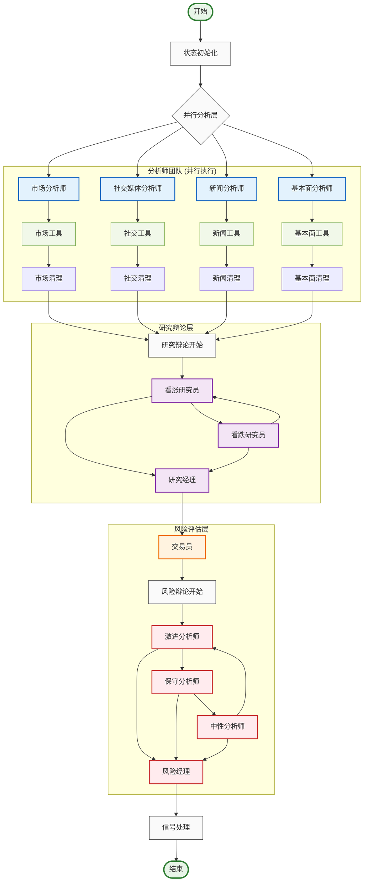
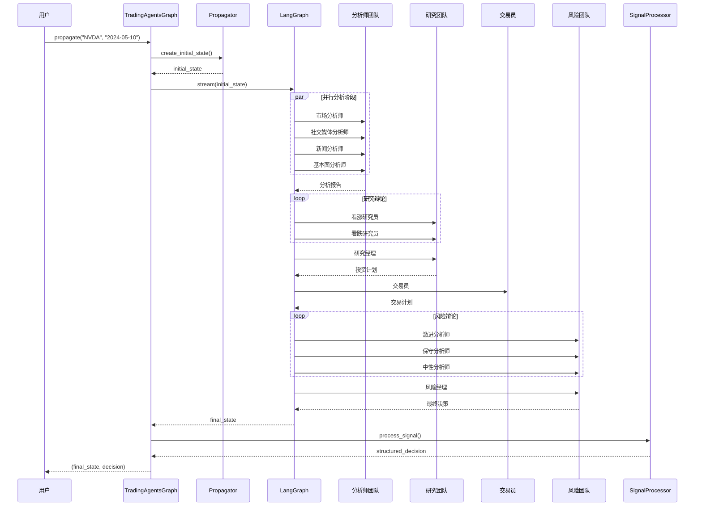

# TradingAgents 图结构架构

## 概述

TradingAgents 基于 LangGraph 构建了一个复杂的多智能体协作图结构，通过有向无环图（DAG）的方式组织智能体工作流。系统采用状态驱动的图执行模式，支持条件路由、并行处理和动态决策。

## 🏗️ 图结构设计原理

### 核心设计理念

- **状态驱动**: 基于 `AgentState` 的统一状态管理
- **条件路由**: 智能的工作流分支决策
- **并行处理**: 分析师团队的并行执行
- **层次化协作**: 分析→研究→执行→风险→管理的层次结构
- **记忆机制**: 智能体间的经验共享和学习

### 图结构架构图



## 📋 核心组件详解

### 1. TradingAgentsGraph 主控制器

**文件位置**: `tradingagents/graph/trading_graph.py`

```python
class TradingAgentsGraph:
    """交易智能体图的主要编排类"""
    
    def __init__(
        self,
        selected_analysts=["market", "social", "news", "fundamentals"],
        debug=False,
        config: Dict[str, Any] = None,
    ):
        """初始化交易智能体图和组件"""
        self.debug = debug
        self.config = config or DEFAULT_CONFIG
        
        # 初始化LLM
        self._initialize_llms()
        
        # 初始化核心组件
        self.setup = GraphSetup(
            quick_thinking_llm=self.quick_thinking_llm,
            deep_thinking_llm=self.deep_thinking_llm,
            toolkit=self.toolkit,
            tool_nodes=self.tool_nodes,
            bull_memory=self.bull_memory,
            bear_memory=self.bear_memory,
            trader_memory=self.trader_memory,
            invest_judge_memory=self.invest_judge_memory,
            risk_manager_memory=self.risk_manager_memory,
            conditional_logic=self.conditional_logic,
            config=self.config
        )
        
        # 构建图
        self.graph = self.setup.setup_graph(selected_analysts)
    
    def propagate(self, company_name: str, trade_date: str):
        """执行完整的交易分析流程"""
        # 创建初始状态
        initial_state = self.propagator.create_initial_state(
            company_name, trade_date
        )
        
        # 执行图
        graph_args = self.propagator.get_graph_args()
        
        for step in self.graph.stream(initial_state, **graph_args):
            if self.debug:
                print(step)
        
        # 处理最终信号
        final_signal = step.get("final_trade_decision", "")
        decision = self.signal_processor.process_signal(
            final_signal, company_name
        )
        
        return step, decision
```

### 2. GraphSetup 图构建器

**文件位置**: `tradingagents/graph/setup.py`

```python
class GraphSetup:
    """负责构建和配置LangGraph工作流"""
    
    def setup_graph(self, selected_analysts=["market", "social", "news", "fundamentals"]):
        """设置和编译智能体工作流图"""
        workflow = StateGraph(AgentState)
        
        # 1. 添加分析师节点
        analyst_nodes = {}
        tool_nodes = {}
        delete_nodes = {}
        
        if "market" in selected_analysts:
            analyst_nodes["market"] = create_market_analyst(
                self.quick_thinking_llm, self.toolkit
            )
            tool_nodes["market"] = self.tool_nodes["market"]
            delete_nodes["market"] = create_msg_delete()
        
        # 类似地添加其他分析师...
        
        # 2. 添加研究员节点
        bull_researcher_node = create_bull_researcher(
            self.quick_thinking_llm, self.bull_memory
        )
        bear_researcher_node = create_bear_researcher(
            self.quick_thinking_llm, self.bear_memory
        )
        research_manager_node = create_research_manager(
            self.deep_thinking_llm, self.invest_judge_memory
        )
        
        # 3. 添加交易员和风险管理节点
        trader_node = create_trader(
            self.quick_thinking_llm, self.trader_memory
        )
        
        risky_analyst_node = create_risky_analyst(self.quick_thinking_llm)
        safe_analyst_node = create_safe_analyst(self.quick_thinking_llm)
        neutral_analyst_node = create_neutral_analyst(self.quick_thinking_llm)
        risk_judge_node = create_risk_judge(
            self.deep_thinking_llm, self.risk_manager_memory
        )
        
        # 4. 将节点添加到工作流
        for name, node in analyst_nodes.items():
            workflow.add_node(name, node)
            workflow.add_node(f"tools_{name}", tool_nodes[name])
            workflow.add_node(f"Msg Clear {name.title()}", delete_nodes[name])
        
        workflow.add_node("Bull Researcher", bull_researcher_node)
        workflow.add_node("Bear Researcher", bear_researcher_node)
        workflow.add_node("Research Manager", research_manager_node)
        workflow.add_node("Trader", trader_node)
        workflow.add_node("Risky Analyst", risky_analyst_node)
        workflow.add_node("Safe Analyst", safe_analyst_node)
        workflow.add_node("Neutral Analyst", neutral_analyst_node)
        workflow.add_node("Risk Judge", risk_judge_node)
        
        # 5. 定义边和条件路由
        self._define_edges(workflow, selected_analysts)
        
        return workflow.compile()
```

### 3. ConditionalLogic 条件路由

**文件位置**: `tradingagents/graph/conditional_logic.py`

```python
class ConditionalLogic:
    """处理图流程的条件逻辑"""
    
    def __init__(self, max_debate_rounds=1, max_risk_discuss_rounds=1):
        self.max_debate_rounds = max_debate_rounds
        self.max_risk_discuss_rounds = max_risk_discuss_rounds
    
    def should_continue_market(self, state: AgentState):
        """判断市场分析是否应该继续"""
        messages = state["messages"]
        last_message = messages[-1]
        
        if hasattr(last_message, 'tool_calls') and last_message.tool_calls:
            return "tools_market"
        return "Msg Clear Market"
    
    def should_continue_debate(self, state: AgentState) -> str:
        """判断辩论是否应该继续"""
        if state["investment_debate_state"]["count"] >= 2 * self.max_debate_rounds:
            return "Research Manager"
        if state["investment_debate_state"]["current_response"].startswith("Bull"):
            return "Bear Researcher"
        return "Bull Researcher"
    
    def should_continue_risk_analysis(self, state: AgentState) -> str:
        """判断风险分析是否应该继续"""
        if state["risk_debate_state"]["count"] >= 3 * self.max_risk_discuss_rounds:
            return "Risk Judge"
        
        latest_speaker = state["risk_debate_state"]["latest_speaker"]
        if latest_speaker.startswith("Risky"):
            return "Safe Analyst"
        elif latest_speaker.startswith("Safe"):
            return "Neutral Analyst"
        return "Risky Analyst"
```

### 4. AgentState 状态管理

**文件位置**: `tradingagents/agents/utils/agent_states.py`

```python
class AgentState(MessagesState):
    """智能体状态定义"""
    # 基本信息
    company_of_interest: Annotated[str, "我们感兴趣交易的公司"]
    trade_date: Annotated[str, "交易日期"]
    sender: Annotated[str, "发送此消息的智能体"]
    
    # 分析报告
    market_report: Annotated[str, "市场分析师的报告"]
    sentiment_report: Annotated[str, "社交媒体分析师的报告"]
    news_report: Annotated[str, "新闻研究员的报告"]
    fundamentals_report: Annotated[str, "基本面研究员的报告"]
    
    # 研究团队讨论状态
    investment_debate_state: Annotated[InvestDebateState, "投资辩论的当前状态"]
    investment_plan: Annotated[str, "分析师生成的计划"]
    trader_investment_plan: Annotated[str, "交易员生成的计划"]
    
    # 风险管理团队讨论状态
    risk_debate_state: Annotated[RiskDebateState, "风险评估辩论的当前状态"]
    final_trade_decision: Annotated[str, "风险分析师做出的最终决策"]

class InvestDebateState(TypedDict):
    """研究团队状态"""
    bull_history: Annotated[str, "看涨对话历史"]
    bear_history: Annotated[str, "看跌对话历史"]
    history: Annotated[str, "对话历史"]
    current_response: Annotated[str, "最新回应"]
    judge_decision: Annotated[str, "最终判断决策"]
    count: Annotated[int, "当前对话长度"]

class RiskDebateState(TypedDict):
    """风险管理团队状态"""
    risky_history: Annotated[str, "激进分析师的对话历史"]
    safe_history: Annotated[str, "保守分析师的对话历史"]
    neutral_history: Annotated[str, "中性分析师的对话历史"]
    history: Annotated[str, "对话历史"]
    latest_speaker: Annotated[str, "最后发言的分析师"]
    current_risky_response: Annotated[str, "激进分析师的最新回应"]
    current_safe_response: Annotated[str, "保守分析师的最新回应"]
    current_neutral_response: Annotated[str, "中性分析师的最新回应"]
    judge_decision: Annotated[str, "判断决策"]
    count: Annotated[int, "当前对话长度"]
```

### 5. Propagator 状态传播器

**文件位置**: `tradingagents/graph/propagation.py`

```python
class Propagator:
    """处理状态初始化和在图中的传播"""
    
    def __init__(self, max_recur_limit=100):
        self.max_recur_limit = max_recur_limit
    
    def create_initial_state(self, company_name: str, trade_date: str) -> Dict[str, Any]:
        """为智能体图创建初始状态"""
        return {
            "messages": [("human", company_name)],
            "company_of_interest": company_name,
            "trade_date": str(trade_date),
            "investment_debate_state": InvestDebateState({
                "history": "",
                "current_response": "",
                "count": 0
            }),
            "risk_debate_state": RiskDebateState({
                "history": "",
                "current_risky_response": "",
                "current_safe_response": "",
                "current_neutral_response": "",
                "count": 0,
            }),
            "market_report": "",
            "fundamentals_report": "",
            "sentiment_report": "",
            "news_report": "",
        }
    
    def get_graph_args(self) -> Dict[str, Any]:
        """获取图调用的参数"""
        return {
            "stream_mode": "values",
            "config": {"recursion_limit": self.max_recur_limit},
        }
```

### 6. SignalProcessor 信号处理器

**文件位置**: `tradingagents/graph/signal_processing.py`

```python
class SignalProcessor:
    """处理交易信号以提取可操作的决策"""
    
    def __init__(self, quick_thinking_llm: ChatOpenAI):
        self.quick_thinking_llm = quick_thinking_llm
    
    def process_signal(self, full_signal: str, stock_symbol: str = None) -> dict:
        """处理完整的交易信号以提取结构化决策信息"""
        
        # 检测股票类型和货币
        from tradingagents.utils.stock_utils import StockUtils
        market_info = StockUtils.get_market_info(stock_symbol)
        
        messages = [
            ("system", f"""您是一位专业的金融分析助手，负责从交易员的分析报告中提取结构化的投资决策信息。

请从提供的分析报告中提取以下信息，并以JSON格式返回：

{{
    "action": "买入/持有/卖出",
    "target_price": 数字({market_info['currency_name']}价格),
    "confidence": 数字(0-1之间),
    "risk_score": 数字(0-1之间),
    "reasoning": "决策的主要理由摘要"
}}
"""),
            ("human", full_signal),
        ]
        
        try:
            result = self.quick_thinking_llm.invoke(messages).content
            # 解析JSON并返回结构化决策
            return self._parse_decision(result)
        except Exception as e:
            logger.error(f"信号处理失败: {e}")
            return self._get_default_decision()
```

### 7. Reflector 反思器

**文件位置**: `tradingagents/graph/reflection.py`

```python
class Reflector:
    """处理决策反思和记忆更新"""
    
    def __init__(self, quick_thinking_llm: ChatOpenAI):
        self.quick_thinking_llm = quick_thinking_llm
        self.reflection_system_prompt = self._get_reflection_prompt()
    
    def reflect_bull_researcher(self, current_state, returns_losses, bull_memory):
        """反思看涨研究员的分析并更新记忆"""
        situation = self._extract_current_situation(current_state)
        bull_debate_history = current_state["investment_debate_state"]["bull_history"]
        
        result = self._reflect_on_component(
            "BULL", bull_debate_history, situation, returns_losses
        )
        bull_memory.add_situations([(situation, result)])
    
    def reflect_trader(self, current_state, returns_losses, trader_memory):
        """反思交易员的决策并更新记忆"""
        situation = self._extract_current_situation(current_state)
        trader_decision = current_state["trader_investment_plan"]
        
        result = self._reflect_on_component(
            "TRADER", trader_decision, situation, returns_losses
        )
        trader_memory.add_situations([(situation, result)])
```

## 🔄 图执行流程

### 执行时序图



### 状态流转过程

1. **初始化阶段**
   ```python
   initial_state = {
       "messages": [("human", "NVDA")],
       "company_of_interest": "NVDA",
       "trade_date": "2024-05-10",
       "investment_debate_state": {...},
       "risk_debate_state": {...},
       # 各种报告字段初始化为空字符串
   }
   ```

2. **分析师并行执行**
   - 市场分析师 → `market_report`
   - 社交媒体分析师 → `sentiment_report`
   - 新闻分析师 → `news_report`
   - 基本面分析师 → `fundamentals_report`

3. **研究团队辩论**
   ```python
   investment_debate_state = {
       "bull_history": "看涨观点历史",
       "bear_history": "看跌观点历史",
       "count": 辩论轮次,
       "judge_decision": "研究经理的最终决策"
   }
   ```

4. **交易员决策**
   - 基于研究团队的投资计划生成具体的交易策略
   - 更新 `trader_investment_plan`

5. **风险团队评估**
   ```python
   risk_debate_state = {
       "risky_history": "激进观点历史",
       "safe_history": "保守观点历史",
       "neutral_history": "中性观点历史",
       "count": 风险讨论轮次,
       "judge_decision": "风险经理的最终决策"
   }
   ```

6. **信号处理**
   - 提取结构化决策信息
   - 返回 `{action, target_price, confidence, risk_score, reasoning}`

## ⚙️ 边和路由设计

### 边类型分类

#### 1. 顺序边 (Sequential Edges)
```python
# 分析师完成后进入研究阶段
workflow.add_edge("Msg Clear Market", "Bull Researcher")
workflow.add_edge("Msg Clear Social", "Bull Researcher")
workflow.add_edge("Msg Clear News", "Bull Researcher")
workflow.add_edge("Msg Clear Fundamentals", "Bull Researcher")

# 研究经理 → 交易员
workflow.add_edge("Research Manager", "Trader")

# 交易员 → 风险分析
workflow.add_edge("Trader", "Risky Analyst")
```

#### 2. 条件边 (Conditional Edges)
```python
# 分析师工具调用条件
workflow.add_conditional_edges(
    "market",
    self.conditional_logic.should_continue_market,
    {
        "tools_market": "tools_market",
        "Msg Clear Market": "Msg Clear Market",
    },
)

# 研究辩论条件
workflow.add_conditional_edges(
    "Bull Researcher",
    self.conditional_logic.should_continue_debate,
    {
        "Bear Researcher": "Bear Researcher",
        "Research Manager": "Research Manager",
    },
)

# 风险分析条件
workflow.add_conditional_edges(
    "Risky Analyst",
    self.conditional_logic.should_continue_risk_analysis,
    {
        "Safe Analyst": "Safe Analyst",
        "Neutral Analyst": "Neutral Analyst",
        "Risk Judge": "Risk Judge",
    },
)
```

#### 3. 并行边 (Parallel Edges)
```python
# 从START同时启动所有分析师
workflow.add_edge(START, "market")
workflow.add_edge(START, "social")
workflow.add_edge(START, "news")
workflow.add_edge(START, "fundamentals")
```

### 路由决策逻辑

#### 工具调用路由
```python
def should_continue_market(self, state: AgentState):
    """基于最后消息是否包含工具调用来决定路由"""
    messages = state["messages"]
    last_message = messages[-1]
    
    if hasattr(last_message, 'tool_calls') and last_message.tool_calls:
        return "tools_market"  # 执行工具
    return "Msg Clear Market"  # 清理消息并继续
```

#### 辩论轮次路由
```python
def should_continue_debate(self, state: AgentState) -> str:
    """基于辩论轮次和当前发言者决定下一步"""
    # 检查是否达到最大轮次
    if state["investment_debate_state"]["count"] >= 2 * self.max_debate_rounds:
        return "Research Manager"  # 结束辩论
    
    # 基于当前发言者决定下一个发言者
    if state["investment_debate_state"]["current_response"].startswith("Bull"):
        return "Bear Researcher"
    return "Bull Researcher"
```

## 🔧 错误处理和恢复

### 节点级错误处理

```python
# 在每个智能体节点中
try:
    # 执行智能体逻辑
    result = agent.invoke(state)
    return {"messages": [result]}
except Exception as e:
    logger.error(f"智能体执行失败: {e}")
    # 返回默认响应
    return {"messages": [("ai", "分析暂时不可用，请稍后重试")]}
```

### 图级错误恢复

```python
# 在TradingAgentsGraph中
try:
    for step in self.graph.stream(initial_state, **graph_args):
        if self.debug:
            print(step)
except Exception as e:
    logger.error(f"图执行失败: {e}")
    # 返回安全的默认决策
    return None, {
        'action': '持有',
        'target_price': None,
        'confidence': 0.5,
        'risk_score': 0.5,
        'reasoning': '系统错误，建议持有'
    }
```

### 超时和递归限制

```python
# 在Propagator中设置递归限制
def get_graph_args(self) -> Dict[str, Any]:
    return {
        "stream_mode": "values",
        "config": {
            "recursion_limit": self.max_recur_limit,  # 默认100
            "timeout": 300,  # 5分钟超时
        },
    }
```

## 📊 性能监控和优化

### 执行时间监控

```python
import time
from tradingagents.utils.tool_logging import log_graph_module

@log_graph_module("graph_execution")
def propagate(self, company_name: str, trade_date: str):
    start_time = time.time()
    
    # 执行图
    result = self.graph.stream(initial_state, **graph_args)
    
    execution_time = time.time() - start_time
    logger.info(f"图执行完成，耗时: {execution_time:.2f}秒")
    
    return result
```

### 内存使用优化

```python
# 在状态传播过程中清理不必要的消息
class MessageCleaner:
    def clean_messages(self, state: AgentState):
        # 只保留最近的N条消息
        if len(state["messages"]) > 50:
            state["messages"] = state["messages"][-50:]
        return state
```

### 并行执行优化

```python
# 分析师团队的并行执行通过LangGraph自动处理
# 无需额外配置，START节点的多个边会自动并行执行
workflow.add_edge(START, "market")
workflow.add_edge(START, "social")
workflow.add_edge(START, "news")
workflow.add_edge(START, "fundamentals")
```

## 🚀 扩展和定制

### 添加新的分析师

```python
# 1. 创建新的分析师函数
def create_custom_analyst(llm, toolkit):
    # 实现自定义分析师逻辑
    pass

# 2. 在GraphSetup中添加
if "custom" in selected_analysts:
    analyst_nodes["custom"] = create_custom_analyst(
        self.quick_thinking_llm, self.toolkit
    )
    tool_nodes["custom"] = self.tool_nodes["custom"]
    delete_nodes["custom"] = create_msg_delete()

# 3. 添加条件逻辑
def should_continue_custom(self, state: AgentState):
    # 实现自定义条件逻辑
    pass
```

### 自定义辩论机制

```python
# 扩展辩论状态
class CustomDebateState(TypedDict):
    participants: List[str]
    rounds: int
    max_rounds: int
    current_speaker: str
    history: Dict[str, str]

# 实现自定义辩论逻辑
def should_continue_custom_debate(self, state: AgentState) -> str:
    debate_state = state["custom_debate_state"]
    
    if debate_state["rounds"] >= debate_state["max_rounds"]:
        return "END_DEBATE"
    
    # 轮换发言者逻辑
    current_idx = debate_state["participants"].index(
        debate_state["current_speaker"]
    )
    next_idx = (current_idx + 1) % len(debate_state["participants"])
    
    return debate_state["participants"][next_idx]
```

### 动态图构建

```python
class DynamicGraphSetup(GraphSetup):
    def build_dynamic_graph(self, config: Dict[str, Any]):
        """基于配置动态构建图结构"""
        workflow = StateGraph(AgentState)
        
        # 基于配置添加节点
        for node_config in config["nodes"]:
            node_type = node_config["type"]
            node_name = node_config["name"]
            
            if node_type == "analyst":
                workflow.add_node(node_name, self._create_analyst(node_config))
            elif node_type == "researcher":
                workflow.add_node(node_name, self._create_researcher(node_config))
        
        # 基于配置添加边
        for edge_config in config["edges"]:
            if edge_config["type"] == "conditional":
                workflow.add_conditional_edges(
                    edge_config["from"],
                    self._get_condition_func(edge_config["condition"]),
                    edge_config["mapping"]
                )
            else:
                workflow.add_edge(edge_config["from"], edge_config["to"])
        
        return workflow.compile()
```

## 📝 最佳实践

### 1. 状态设计原则
- **最小化状态**: 只在状态中保存必要的信息
- **类型安全**: 使用 TypedDict 和 Annotated 确保类型安全
- **状态不变性**: 避免直接修改状态，使用返回新状态的方式

### 2. 节点设计原则
- **单一职责**: 每个节点只负责一个特定的任务
- **幂等性**: 节点应该是幂等的，多次执行产生相同结果
- **错误处理**: 每个节点都应该有适当的错误处理机制

### 3. 边设计原则
- **明确条件**: 条件边的逻辑应该清晰明确
- **避免死锁**: 确保图中不存在无法退出的循环
- **性能考虑**: 避免不必要的条件检查

### 4. 调试和监控
- **日志记录**: 在关键节点添加详细的日志记录
- **状态跟踪**: 跟踪状态在图中的传播过程
- **性能监控**: 监控每个节点的执行时间和资源使用

## 🔮 未来发展方向

### 1. 图结构优化
- **动态图构建**: 基于市场条件动态调整图结构
- **自适应路由**: 基于历史性能自动优化路由决策
- **图压缩**: 优化图结构以减少执行时间

### 2. 智能体协作增强
- **协作学习**: 智能体间的知识共享和协同学习
- **角色专业化**: 更细粒度的智能体角色分工
- **动态团队组建**: 基于任务需求动态组建智能体团队

### 3. 性能和扩展性
- **分布式执行**: 支持跨多个节点的分布式图执行
- **流式处理**: 支持实时数据流的处理
- **缓存优化**: 智能的中间结果缓存机制

### 4. 可观测性增强
- **可视化调试**: 图执行过程的可视化展示
- **性能分析**: 详细的性能分析和瓶颈识别
- **A/B测试**: 支持不同图结构的A/B测试

---

通过这种基于 LangGraph 的图结构设计，TradingAgents 实现了高度灵活和可扩展的多智能体协作框架，为复杂的金融决策提供了强大的技术支撑。