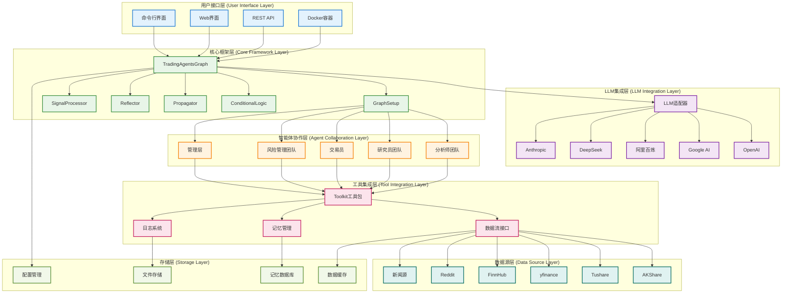
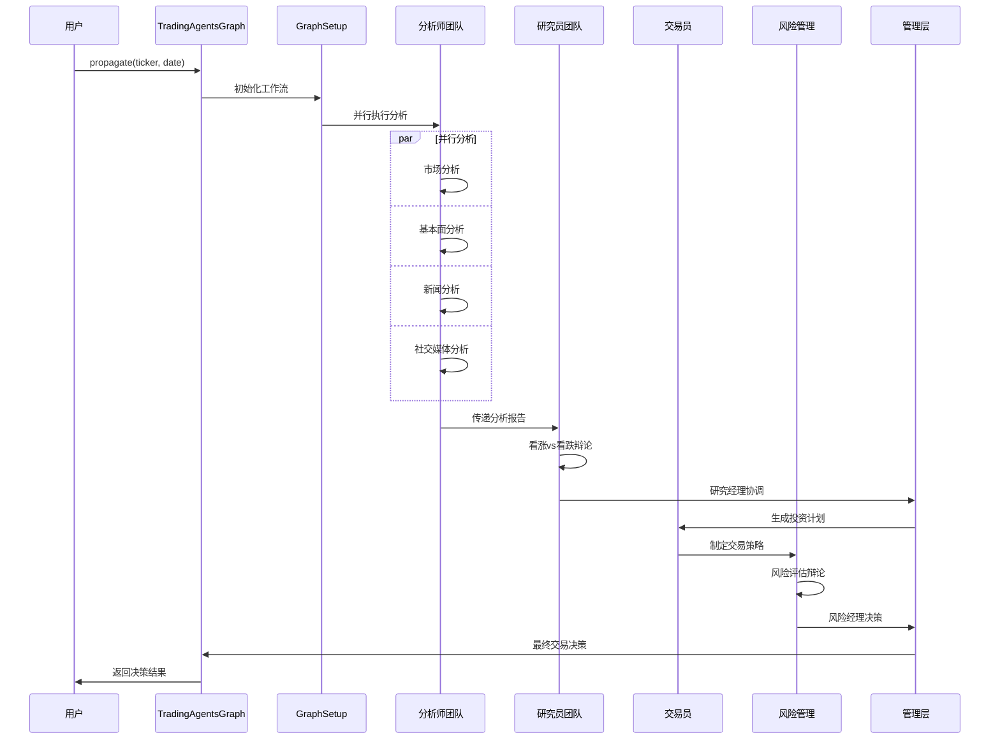

# TradingAgents 系统架构

## 概述

TradingAgents 是一个基于多智能体协作的金融交易决策框架，采用 LangGraph 构建智能体工作流，支持中国A股、港股和美股的全面分析。系统通过模块化设计实现高度可扩展性和可维护性。

## 🏗️ 系统架构设计

### 架构原则

- **模块化设计**: 每个组件独立开发和部署
- **智能体协作**: 多智能体分工合作，模拟真实交易团队
- **数据驱动**: 基于多源数据融合的决策机制
- **可扩展性**: 支持新智能体、数据源和分析工具的快速集成
- **容错性**: 完善的错误处理和降级策略
- **性能优化**: 并行处理和缓存机制

### 系统架构图



## 📋 各层次详细说明

### 1. 用户接口层 (User Interface Layer)

#### 命令行界面 (CLI)
**文件位置**: `main.py`

```python
from tradingagents.graph.trading_graph import TradingAgentsGraph
from tradingagents.default_config import DEFAULT_CONFIG

# 创建自定义配置
config = DEFAULT_CONFIG.copy()
config["llm_provider"] = "google"
config["deep_think_llm"] = "gemini-2.0-flash"
config["quick_think_llm"] = "gemini-2.0-flash"
config["max_debate_rounds"] = 1
config["online_tools"] = True

# 初始化交易图
ta = TradingAgentsGraph(debug=True, config=config)

# 执行分析
_, decision = ta.propagate("NVDA", "2024-05-10")
print(decision)
```

#### Docker容器化部署
**配置文件**: `pyproject.toml`

```toml
[project]
name = "tradingagents"
version = "0.1.13-preview"
description = "Multi-agent trading framework"
requires-python = ">=3.10"

[project.scripts]
tradingagents = "main:main"
```

### 2. LLM集成层 (LLM Integration Layer)

#### LLM适配器架构
**文件位置**: `tradingagents/llm_adapters/`

```python
from langchain_openai import ChatOpenAI
from langchain_anthropic import ChatAnthropic
from langchain_google_genai import ChatGoogleGenerativeAI
from tradingagents.llm_adapters import ChatDashScope, ChatDashScopeOpenAI, ChatGoogleOpenAI

# LLM提供商配置
if config["llm_provider"].lower() == "openai":
    deep_thinking_llm = ChatOpenAI(
        model=config["deep_think_llm"], 
        base_url=config["backend_url"]
    )
    quick_thinking_llm = ChatOpenAI(
        model=config["quick_think_llm"], 
        base_url=config["backend_url"]
    )
elif config["llm_provider"] == "google":
    deep_thinking_llm = ChatGoogleGenerativeAI(
        model=config["deep_think_llm"]
    )
    quick_thinking_llm = ChatGoogleGenerativeAI(
        model=config["quick_think_llm"]
    )
```

#### 支持的LLM提供商

- **OpenAI**: GPT-4o, GPT-4o-mini, o1-preview, o1-mini
- **Google AI**: Gemini-2.0-flash, Gemini-1.5-pro, Gemini-1.5-flash
- **阿里百炼**: Qwen系列模型
- **DeepSeek**: DeepSeek-V3 (高性价比选择)
- **Anthropic**: Claude系列模型

### 3. 核心框架层 (Core Framework Layer)

#### TradingAgentsGraph 主控制器
**文件位置**: `tradingagents/graph/trading_graph.py`

```python
class TradingAgentsGraph:
    """交易智能体图的主要编排类"""
    
    def __init__(
        self,
        selected_analysts=["market", "social", "news", "fundamentals"],
        debug=False,
        config: Dict[str, Any] = None,
    ):
        """初始化交易智能体图和组件
        
        Args:
            selected_analysts: 要包含的分析师类型列表
            debug: 是否运行在调试模式
            config: 配置字典，如果为None则使用默认配置
        """
        self.debug = debug
        self.config = config or DEFAULT_CONFIG
        
        # 更新接口配置
        set_config(self.config)
        
        # 创建必要的目录
        os.makedirs(
            os.path.join(self.config["project_dir"], "dataflows/data_cache"),
            exist_ok=True,
        )
        
        # 初始化LLM
        self._initialize_llms()
        
        # 初始化组件
        self.setup = GraphSetup()
        self.conditional_logic = ConditionalLogic()
        self.propagator = Propagator()
        self.reflector = Reflector()
        self.signal_processor = SignalProcessor()
```

#### GraphSetup 图构建器
**文件位置**: `tradingagents/graph/setup.py`

```python
class GraphSetup:
    """负责构建和配置LangGraph工作流"""
    
    def __init__(self):
        self.workflow = StateGraph(AgentState)
        self.toolkit = None
        
    def build_graph(self, llm, toolkit, selected_analysts):
        """构建完整的智能体工作流图"""
        # 添加分析师节点
        self._add_analyst_nodes(llm, toolkit, selected_analysts)
        
        # 添加研究员节点
        self._add_researcher_nodes(llm)
        
        # 添加交易员节点
        self._add_trader_node(llm)
        
        # 添加风险管理节点
        self._add_risk_management_nodes(llm)
        
        # 添加管理层节点
        self._add_management_nodes(llm)
        
        # 定义工作流边
        self._define_workflow_edges()
        
        return self.workflow.compile()
```

#### ConditionalLogic 条件路由
**文件位置**: `tradingagents/graph/conditional_logic.py`

```python
class ConditionalLogic:
    """处理工作流中的条件分支和路由逻辑"""
    
    def should_continue_debate(self, state: AgentState) -> str:
        """判断是否继续研究员辩论"""
        if state["investment_debate_state"]["count"] >= self.max_debate_rounds:
            return "research_manager"
        return "continue_debate"
    
    def should_continue_risk_discussion(self, state: AgentState) -> str:
        """判断是否继续风险讨论"""
        if state["risk_debate_state"]["count"] >= self.max_risk_rounds:
            return "risk_manager"
        return "continue_risk_discussion"
```

### 4. 智能体协作层 (Agent Collaboration Layer)

#### 状态管理系统
**文件位置**: `tradingagents/agents/utils/agent_states.py`

```python
from typing import Annotated
from langgraph.graph import MessagesState

class AgentState(MessagesState):
    """智能体状态管理类 - 继承自 LangGraph MessagesState"""
    
    # 基础信息
    company_of_interest: Annotated[str, "目标分析公司股票代码"]
    trade_date: Annotated[str, "交易日期"]
    sender: Annotated[str, "发送消息的智能体"]
    
    # 分析师报告
    market_report: Annotated[str, "市场分析师报告"]
    sentiment_report: Annotated[str, "社交媒体分析师报告"]
    news_report: Annotated[str, "新闻分析师报告"]
    fundamentals_report: Annotated[str, "基本面分析师报告"]
    
    # 研究和决策
    investment_debate_state: Annotated[InvestDebateState, "投资辩论状态"]
    investment_plan: Annotated[str, "投资计划"]
    trader_investment_plan: Annotated[str, "交易员投资计划"]
    
    # 风险管理
    risk_debate_state: Annotated[RiskDebateState, "风险辩论状态"]
    final_trade_decision: Annotated[str, "最终交易决策"]
```

#### 智能体工厂模式
**文件位置**: `tradingagents/agents/`

```python
# 分析师创建函数
from tradingagents.agents.analysts import (
    create_fundamentals_analyst,
    create_market_analyst,
    create_news_analyst,
    create_social_media_analyst,
    create_china_market_analyst
)

# 研究员创建函数
from tradingagents.agents.researchers import (
    create_bull_researcher,
    create_bear_researcher
)

# 交易员创建函数
from tradingagents.agents.trader import create_trader

# 风险管理创建函数
from tradingagents.agents.risk_mgmt import (
    create_conservative_debator,
    create_neutral_debator,
    create_aggressive_debator
)

# 管理层创建函数
from tradingagents.agents.managers import (
    create_research_manager,
    create_risk_manager
)
```

### 5. 工具集成层 (Tool Integration Layer)

#### Toolkit 统一工具包
**文件位置**: `tradingagents/agents/utils/agent_utils.py`

```python
class Toolkit:
    """统一工具包，为所有智能体提供数据访问接口"""
    
    def __init__(self, config):
        self.config = config
        self.dataflow = DataFlowInterface(config)
    
    def get_stock_fundamentals_unified(self, ticker: str):
        """统一基本面分析工具，自动识别股票类型"""
        from tradingagents.utils.stock_utils import StockUtils
        market_info = StockUtils.get_market_info(ticker)
        
        if market_info['market_type'] == 'A股':
            return self.dataflow.get_a_stock_fundamentals(ticker)
        elif market_info['market_type'] == '港股':
            return self.dataflow.get_hk_stock_fundamentals(ticker)
        else:
            return self.dataflow.get_us_stock_fundamentals(ticker)
    
    def get_market_data(self, ticker: str, period: str = "1y"):
        """获取市场数据"""
        return self.dataflow.get_market_data(ticker, period)
    
    def get_news_data(self, ticker: str, days: int = 7):
        """获取新闻数据"""
        return self.dataflow.get_news_data(ticker, days)
```

#### 数据流接口
**文件位置**: `tradingagents/dataflows/interface.py`

```python
# 全局配置管理
from .config import get_config, set_config, DATA_DIR

# 数据获取函数
def get_finnhub_news(
    ticker: Annotated[str, "公司股票代码，如 'AAPL', 'TSM' 等"],
    curr_date: Annotated[str, "当前日期，格式为 yyyy-mm-dd"],
    look_back_days: Annotated[int, "回看天数"],
):
    """获取指定时间范围内的公司新闻
    
    Args:
        ticker (str): 目标公司的股票代码
        curr_date (str): 当前日期，格式为 yyyy-mm-dd
        look_back_days (int): 回看天数
    
    Returns:
        str: 包含公司新闻的数据框
    """
    start_date = datetime.strptime(curr_date, "%Y-%m-%d")
    before = start_date - relativedelta(days=look_back_days)
    before = before.strftime("%Y-%m-%d")
    
    result = get_data_in_range(ticker, before, curr_date, "news_data", DATA_DIR)
    
    if len(result) == 0:
        error_msg = f"⚠️ 无法获取{ticker}的新闻数据 ({before} 到 {curr_date})"
        logger.debug(f"📰 [DEBUG] {error_msg}")
        return error_msg
    
    return result
```

#### 记忆管理系统
**文件位置**: `tradingagents/agents/utils/memory.py`

```python
class FinancialSituationMemory:
    """金融情况记忆管理类"""
    
    def __init__(self, config):
        self.config = config
        self.memory_store = {}
    
    def get_memories(self, query: str, n_matches: int = 2):
        """检索相关历史记忆
        
        Args:
            query (str): 查询字符串
            n_matches (int): 返回匹配数量
        
        Returns:
            List[Dict]: 相关记忆列表
        """
        # 实现记忆检索逻辑
        pass
    
    def add_memory(self, content: str, metadata: dict):
        """添加新记忆
        
        Args:
            content (str): 记忆内容
            metadata (dict): 元数据
        """
        # 实现记忆存储逻辑
        pass
```

### 6. 数据源层 (Data Source Layer)

#### 多数据源支持
**文件位置**: `tradingagents/dataflows/`

```python
# AKShare - 中国金融数据
from .akshare_utils import (
    get_hk_stock_data_akshare,
    get_hk_stock_info_akshare
)

# Tushare - 专业金融数据
from .tushare_utils import get_tushare_data

# yfinance - 国际市场数据
from .yfin_utils import get_yahoo_finance_data

# FinnHub - 新闻和基本面数据
from .finnhub_utils import get_data_in_range

# Reddit - 社交媒体情绪
from .reddit_utils import fetch_top_from_category

# 中国社交媒体情绪
from .chinese_finance_utils import get_chinese_social_sentiment

# Google新闻
from .googlenews_utils import get_google_news
```

#### 数据源可用性检查

```python
# 港股工具可用性检查
try:
    from .hk_stock_utils import get_hk_stock_data, get_hk_stock_info
    HK_STOCK_AVAILABLE = True
except ImportError as e:
    logger.warning(f"⚠️ 港股工具不可用: {e}")
    HK_STOCK_AVAILABLE = False

# yfinance可用性检查
try:
    import yfinance as yf
    YF_AVAILABLE = True
except ImportError as e:
    logger.warning(f"⚠️ yfinance库不可用: {e}")
    yf = None
    YF_AVAILABLE = False
```

### 7. 存储层 (Storage Layer)

#### 配置管理
**文件位置**: `tradingagents/default_config.py`

```python
import os

DEFAULT_CONFIG = {
    "project_dir": os.path.abspath(os.path.join(os.path.dirname(__file__), ".")),
    "results_dir": os.getenv("TRADINGAGENTS_RESULTS_DIR", "./results"),
    "data_dir": os.path.join(os.path.expanduser("~"), "Documents", "TradingAgents", "data"),
    "data_cache_dir": os.path.join(
        os.path.abspath(os.path.join(os.path.dirname(__file__), ".")),
        "dataflows/data_cache",
    ),
    # LLM设置
    "llm_provider": "openai",
    "deep_think_llm": "o4-mini",
    "quick_think_llm": "gpt-4o-mini",
    "backend_url": "https://api.openai.com/v1",
    # 辩论和讨论设置
    "max_debate_rounds": 1,
    "max_risk_discuss_rounds": 1,
    "max_recur_limit": 100,
    # 工具设置
    "online_tools": True,
}
```

#### 数据缓存系统
**文件位置**: `tradingagents/dataflows/config.py`

```python
from .config import get_config, set_config, DATA_DIR

# 数据目录配置
DATA_DIR = get_config().get("data_dir", "./data")
CACHE_DIR = get_config().get("data_cache_dir", "./cache")

# 缓存策略
CACHE_EXPIRY = {
    "market_data": 300,  # 5分钟
    "news_data": 3600,   # 1小时
    "fundamentals": 86400,  # 24小时
}
```

## 🔄 系统工作流程

### 完整分析流程



### 数据流转过程

1. **数据获取**: 从多个数据源并行获取数据
2. **数据处理**: 清洗、标准化和缓存数据
3. **智能体分析**: 各智能体基于数据进行专业分析
4. **状态同步**: 通过 `AgentState` 共享分析结果
5. **协作决策**: 多轮辩论和协商形成最终决策
6. **结果输出**: 格式化输出决策结果和推理过程

## 🛠️ 技术栈

### 核心框架
- **LangGraph**: 智能体工作流编排
- **LangChain**: LLM集成和工具调用
- **Python 3.10+**: 主要开发语言

### LLM集成
- **OpenAI**: GPT系列模型
- **Google AI**: Gemini系列模型
- **阿里百炼**: Qwen系列模型
- **DeepSeek**: DeepSeek-V3模型
- **Anthropic**: Claude系列模型

### 数据处理
- **pandas**: 数据分析和处理
- **numpy**: 数值计算
- **yfinance**: 国际市场数据
- **akshare**: 中国金融数据
- **tushare**: 专业金融数据

### 存储和缓存
- **文件系统**: 本地数据缓存
- **JSON**: 配置和状态存储
- **CSV/Parquet**: 数据文件格式

### 部署和运维
- **Docker**: 容器化部署
- **Poetry/pip**: 依赖管理
- **pytest**: 单元测试
- **GitHub Actions**: CI/CD

## ⚙️ 配置管理

### 环境变量配置

```bash
# LLM API密钥
OPENAI_API_KEY=your_openai_key
GOOGLE_API_KEY=your_google_key
DASHSCOPE_API_KEY=your_dashscope_key
DEEPSEEK_API_KEY=your_deepseek_key
ANTHROPIC_API_KEY=your_anthropic_key

# 数据源API密钥
TUSHARE_TOKEN=your_tushare_token
FINNHUB_API_KEY=your_finnhub_key
REDDIT_CLIENT_ID=your_reddit_client_id
REDDIT_CLIENT_SECRET=your_reddit_secret

# 系统配置
TRADINGAGENTS_RESULTS_DIR=./results
TRADINGAGENTS_DATA_DIR=./data
TRADINGAGENTS_LOG_LEVEL=INFO
```

### 运行时配置

```python
# 自定义配置示例
custom_config = {
    "llm_provider": "google",
    "deep_think_llm": "gemini-2.0-flash",
    "quick_think_llm": "gemini-1.5-flash",
    "max_debate_rounds": 3,
    "max_risk_discuss_rounds": 2,
    "online_tools": True,
    "debug": True,
}

ta = TradingAgentsGraph(config=custom_config)
```

## 📊 监控和观测

### 日志系统
**文件位置**: `tradingagents/utils/logging_init.py`

```python
from tradingagents.utils.logging_init import get_logger

# 获取日志记录器
logger = get_logger("default")
logger.info("📊 [系统] 开始分析股票: AAPL")
logger.debug("📊 [DEBUG] 配置信息: {config}")
logger.warning("⚠️ [警告] 数据源不可用")
logger.error("❌ [错误] API调用失败")
```

### 性能监控

```python
# 智能体执行时间监控
from tradingagents.utils.tool_logging import log_analyst_module

@log_analyst_module("market")
def market_analyst_node(state):
    """市场分析师节点，自动记录执行时间和性能指标"""
    # 分析逻辑
    pass
```

### 错误处理和降级

```python
# 数据源降级策略
try:
    data = primary_data_source.get_data(ticker)
except Exception as e:
    logger.warning(f"主数据源失败，切换到备用数据源: {e}")
    data = fallback_data_source.get_data(ticker)

# LLM调用重试机制
from tenacity import retry, stop_after_attempt, wait_exponential

@retry(stop=stop_after_attempt(3), wait=wait_exponential(multiplier=1, min=4, max=10))
def call_llm_with_retry(llm, prompt):
    """带重试机制的LLM调用"""
    return llm.invoke(prompt)
```

## 🚀 扩展性设计

### 添加新智能体

```python
# 1. 创建智能体文件
# tradingagents/agents/analysts/custom_analyst.py
def create_custom_analyst(llm, toolkit):
    @log_analyst_module("custom")
    def custom_analyst_node(state):
        # 自定义分析逻辑
        return state
    return custom_analyst_node

# 2. 更新状态类
class AgentState(MessagesState):
    custom_report: Annotated[str, "自定义分析师报告"]

# 3. 集成到工作流
workflow.add_node("custom_analyst", create_custom_analyst(llm, toolkit))
```

### 添加新数据源

```python
# 1. 创建数据源适配器
# tradingagents/dataflows/custom_data_source.py
def get_custom_data(ticker: str, date: str):
    """自定义数据源接口"""
    # 数据获取逻辑
    pass

# 2. 集成到工具包
class Toolkit:
    def get_custom_data_tool(self, ticker: str):
        return get_custom_data(ticker, self.current_date)
```

### 添加新LLM提供商

```python
# 1. 创建LLM适配器
# tradingagents/llm_adapters/custom_llm.py
class CustomLLMAdapter:
    def __init__(self, api_key, model_name):
        self.api_key = api_key
        self.model_name = model_name
    
    def invoke(self, prompt):
        # 自定义LLM调用逻辑
        pass

# 2. 集成到主配置
if config["llm_provider"] == "custom":
    llm = CustomLLMAdapter(
        api_key=os.getenv("CUSTOM_API_KEY"),
        model_name=config["custom_model"]
    )
```

## 🛡️ 安全性考虑

### API密钥管理
- 使用环境变量存储敏感信息
- 支持 `.env` 文件配置
- 避免在代码中硬编码密钥

### 数据隐私
- 本地数据缓存，不上传敏感信息
- 支持数据加密存储
- 可配置数据保留策略

### 访问控制
- API调用频率限制
- 错误重试机制
- 资源使用监控

## 📈 性能优化

### 并行处理
- 分析师团队并行执行
- 数据获取异步处理
- 智能体状态并发更新

### 缓存策略
- 多层缓存架构
- 智能缓存失效
- 数据预取机制

### 资源管理
- 内存使用优化
- 连接池管理
- 垃圾回收优化

TradingAgents 系统架构通过模块化设计、智能体协作和多源数据融合，为复杂的金融决策提供了强大、可扩展和高性能的技术基础。系统支持多种LLM提供商、数据源和部署方式，能够适应不同的使用场景和性能要求。